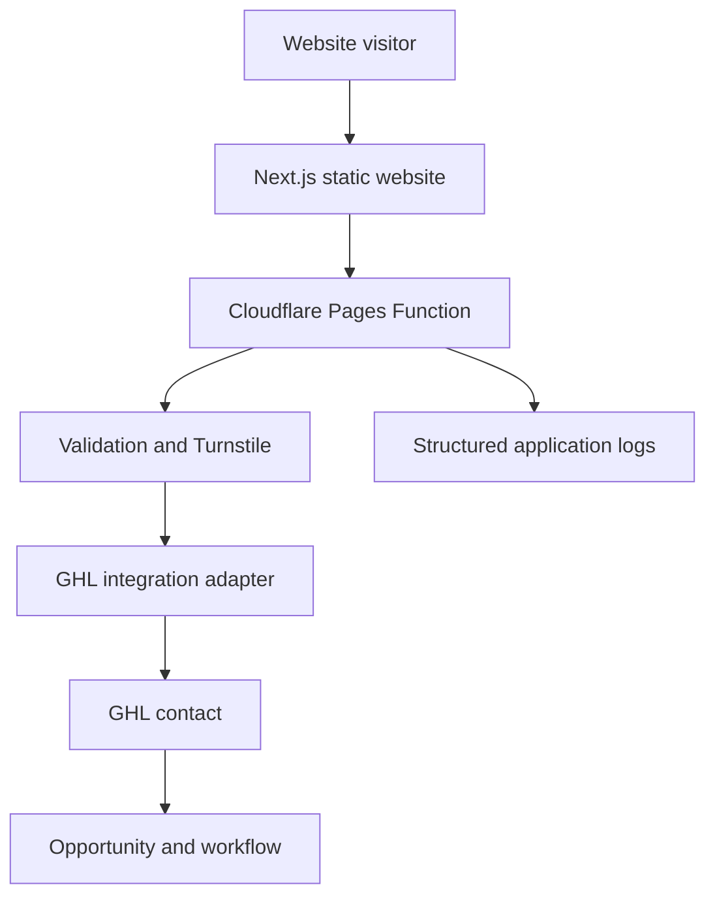
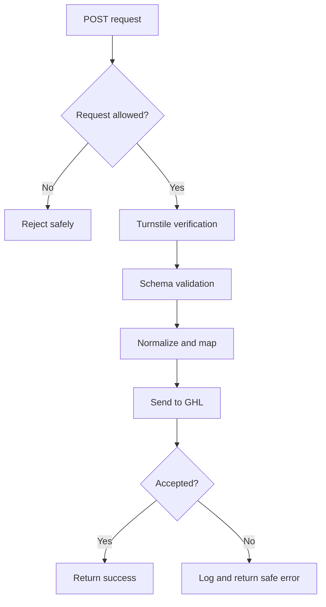
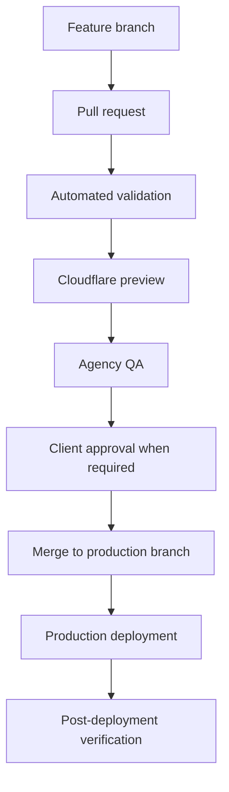

# Plumber Growth System — Technical Architecture

## Document Control

| Field | Value |
|---|---|
| Project | Plumber Growth System |
| Document | Technical Architecture |
| Document ID | 05-technical-architecture |
| Version | 1.0 |
| Status | Draft for Approval |
| Parent Documents | 00-project-overview.md through 04-website-information-architecture.md |
| Frontend | Next.js and TypeScript |
| Hosting | Cloudflare Pages |
| Serverless Processing | Cloudflare Pages Functions |
| CRM and Automation | GoHighLevel |
| Source Control | GitHub |

---

## 1. Purpose

This document defines the technical architecture for the Plumber Growth System website template and its integration with Cloudflare and GoHighLevel.

It establishes:

- Application structure
- Repository strategy
- Rendering model
- Client configuration
- Form processing
- GoHighLevel integration
- Environment variables
- Security boundaries
- Deployment environments
- Testing
- Logging
- Monitoring
- Release procedures

---

## 2. Architecture Summary

The public plumbing website will be a statically generated Next.js application deployed to Cloudflare Pages.

Dynamic form processing will be handled by Cloudflare Pages Functions.

GoHighLevel will remain the system of record for:

- Contacts
- Conversations
- Opportunities
- Pipeline activity
- Appointments
- Review workflows
- Lead-response workflows
- SaaS customer accounts



---

## 3. Architectural Decisions

### ADR-001: Next.js owns the public website

The website will not use:

* GHL Websites
* GHL Funnels
* GHL Form Builder
* GHL Survey Builder

### ADR-002: Static-first rendering

Use static generation for public content wherever practical.

Benefits include:

* Fast global delivery
* Reduced runtime dependencies
* Predictable Cloudflare hosting
* Strong cacheability
* Reduced server attack surface

### ADR-003: Cloudflare handles dynamic form processing

Cloudflare Pages Functions will process forms because a fully static export cannot safely store private GHL credentials or perform trusted server-side validation.

### ADR-004: GHL remains the operational system of record

The website will not create a separate customer database during the initial release.

GHL will store operational lead and customer records.

### ADR-005: One client deployment per Cloudflare project

Each plumbing client should receive:

* A distinct Cloudflare Pages project
* Client-specific environment variables
* Client-specific domain configuration
* Client-specific production deployment
* A distinct GHL sub-account

This isolates clients and reduces the risk of cross-client configuration or data exposure.

### ADR-006: Shared reusable codebase

The agency will maintain one canonical template repository.

Client websites should be created from a controlled template release rather than manually copying arbitrary files.

### ADR-007: No public file uploads in version one

Photo and document uploads will remain disabled until secure storage, validation, retention, and access-control requirements are approved.

Forms may request that customers provide files through a separately approved secure process.

---

## 4. Repository Strategy

### 4.1 Canonical template repository

Recommended repository:

```text
plumber-growth-website-template
```

This repository contains:

* Reusable application code
* Design system
* Page templates
* Form components
* Cloudflare Functions
* GHL integration adapters
* Default plumbing content structures
* Documentation
* Tests
* Example client configuration

### 4.2 Client repository strategy

Recommended initial model:

* Create a separate private repository from the canonical template for each paying client.
* Store client-specific public configuration in that repository.
* Store secrets only in Cloudflare environment variables.
* Record the template version used for each client.
* Port approved template improvements into client repositories through controlled updates.

Recommended client repository naming convention:

```text
client-slug-plumbing-website
```

Example:

```text
acme-plumbing-website
```

### 4.3 Alternative future model

A centralized multi-client deployment system may be evaluated after the pilot.

Do not introduce multi-tenancy before the agency understands:

* Update frequency
* Client customization patterns
* Deployment volume
* Isolation requirements
* Rollback needs
* Support load

---

## 5. Framework Requirements

Use:

* Next.js App Router
* TypeScript in strict mode
* React
* Static export where compatible
* Serverless code isolated in Cloudflare Pages Functions
* Standards-based HTML forms
* Minimal client-side JavaScript

The exact supported framework version must be selected and pinned when the repository is initialized.

Do not use floating major-version dependencies.

---

## 6. Rendering Strategy

### 6.1 Static content

Statically generate:

* Homepage
* Services hub
* Service pages
* Residential Plumbing
* Commercial Plumbing
* Service Areas hub
* Approved location pages
* About
* Reviews
* Financing
* FAQs
* Contact
* Request Service
* Emergency Request
* Review Feedback
* Privacy Policy
* Terms
* Thank You shell

### 6.2 Client-side interactivity

Use client components only where required for:

* Mobile navigation
* Form state
* Conditional form fields
* Turnstile
* Accessible disclosure components
* Approved analytics events
* Limited interactive UI

Do not convert entire pages into client components for minor interactions.

### 6.3 Runtime content

Avoid runtime content fetching for primary public pages during version one.

Client content should be validated and built into the static deployment.

---

## 7. Recommended Repository Structure

```text
plumber-growth-website-template/
├── app/
│   ├── layout.tsx
│   ├── page.tsx
│   ├── not-found.tsx
│   ├── sitemap.ts
│   ├── robots.ts
│   ├── services/
│   │   ├── page.tsx
│   │   └── [service]/
│   │       └── page.tsx
│   ├── residential-plumbing/
│   │   └── page.tsx
│   ├── commercial-plumbing/
│   │   └── page.tsx
│   ├── service-areas/
│   │   ├── page.tsx
│   │   └── [location]/
│   │       └── page.tsx
│   ├── about/
│   │   └── page.tsx
│   ├── reviews/
│   │   └── page.tsx
│   ├── financing/
│   │   └── page.tsx
│   ├── faqs/
│   │   └── page.tsx
│   ├── contact/
│   │   └── page.tsx
│   ├── request-service/
│   │   └── page.tsx
│   ├── emergency-plumbing-request/
│   │   └── page.tsx
│   ├── review-feedback/
│   │   └── page.tsx
│   ├── client-onboarding/
│   │   └── page.tsx
│   ├── privacy-policy/
│   │   └── page.tsx
│   ├── terms/
│   │   └── page.tsx
│   └── thank-you/
│       └── page.tsx
├── components/
│   ├── analytics/
│   ├── forms/
│   │   ├── GeneralQuoteForm.tsx
│   │   ├── EmergencyRequestForm.tsx
│   │   ├── ContactForm.tsx
│   │   ├── ReviewFeedbackForm.tsx
│   │   ├── WebsiteOnboardingForm.tsx
│   │   ├── FormField.tsx
│   │   ├── FormErrorSummary.tsx
│   │   └── TurnstileWidget.tsx
│   ├── layout/
│   ├── navigation/
│   ├── sections/
│   ├── seo/
│   └── ui/
├── config/
│   ├── client.ts
│   ├── navigation.ts
│   ├── services.ts
│   ├── service-areas.ts
│   ├── forms.ts
│   └── seo.ts
├── content/
│   ├── services/
│   ├── locations/
│   ├── faqs/
│   ├── reviews/
│   └── legal/
├── functions/
│   ├── api/
│   │   └── forms/
│   │       └── [[form]].ts
│   └── _middleware.ts
├── lib/
│   ├── analytics/
│   ├── forms/
│   │   ├── schemas.ts
│   │   ├── normalize.ts
│   │   ├── attribution.ts
│   │   └── responses.ts
│   ├── ghl/
│   │   ├── client.ts
│   │   ├── contacts.ts
│   │   ├── opportunities.ts
│   │   ├── webhooks.ts
│   │   ├── field-map.ts
│   │   └── types.ts
│   ├── security/
│   │   ├── turnstile.ts
│   │   ├── rate-limit.ts
│   │   └── request.ts
│   ├── seo/
│   └── utilities/
├── public/
│   ├── images/
│   ├── icons/
│   └── brand/
├── tests/
│   ├── unit/
│   ├── integration/
│   ├── accessibility/
│   └── e2e/
├── docs/
├── next.config.ts
├── package.json
├── tsconfig.json
└── wrangler.toml
```

The final structure may be adjusted during repository initialization, but the separation of frontend, configuration, serverless processing, integrations, and tests must remain clear.

---

## 8. Client Configuration Architecture

### 8.1 Public configuration

Public business information may be stored in typed configuration files.

Example:

```ts
export interface ClientConfig {
  business: {
    legalName: string;
    publicName: string;
    description: string;
    phone: string;
    smsPhone?: string;
    email: string;
    websiteUrl: string;
  };
  location: {
    addressDisplayMode: "full" | "service-area";
    streetAddress?: string;
    city: string;
    state: string;
    postalCode?: string;
    country: "US";
  };
  operations: {
    businessHours: BusinessHours;
    emergencyServiceAvailable: boolean;
    twentyFourSevenService: boolean;
    residentialPlumbing: boolean;
    commercialPlumbing: boolean;
  };
  credentials: {
    licenseNumber?: string;
    insured?: boolean;
    bonded?: boolean;
  };
  branding: BrandConfig;
  services: ServiceReference[];
  serviceAreas: ServiceAreaReference[];
  integrations: PublicIntegrationConfig;
  seo: SeoConfig;
}
```

### 8.2 Configuration rules

* Configuration must be type checked.
* Required values must fail the build when missing.
* URLs must be validated.
* Phone numbers must use a consistent internal format.
* Unsupported claims must not have permissive placeholder defaults.
* Disabled pages must not appear in navigation or the sitemap.
* Emergency claims must be explicit, not inferred.
* Production builds must not use demonstration values.

### 8.3 Private configuration

The following must not appear in public configuration:

* GHL private integration token
* Private inbound webhook URL
* Turnstile secret
* Internal notification credentials
* Signing secrets
* Private account identifiers not required by the browser
* API secrets
* Administrative access information

---

## 9. Content Architecture

Use structured content for repeatable page generation.

### Service content model

```ts
export interface PlumbingService {
  slug: string;
  name: string;
  shortDescription: string;
  introduction: string;
  problems: string[];
  serviceProcess: ServiceStep[];
  relatedServices: string[];
  faqs: FaqItem[];
  enabled: boolean;
  indexable: boolean;
}
```

### Service-area content model

```ts
export interface ServiceArea {
  slug: string;
  name: string;
  state: string;
  summary: string;
  neighborhoods?: string[];
  postalCodes?: string[];
  localDetails: string[];
  enabledServices: string[];
  enabled: boolean;
  indexable: boolean;
  officeLocation: boolean;
}
```

The build must reject unknown service references and duplicate slugs.

---

## 10. Form Frontend Architecture

### 10.1 Native controls

Forms must use native elements such as:

* `form`
* `label`
* `input`
* `select`
* `textarea`
* `button`
* `fieldset`
* `legend`

### 10.2 Submission behavior

The form component will:

1. Validate basic required fields.
2. Request a Turnstile token.
3. Submit JSON or multipart data to the Cloudflare endpoint.
4. Disable duplicate submission while pending.
5. Handle validation errors.
6. Announce errors accessibly.
7. Display confirmation or redirect safely.
8. Record an analytics event only after accepted submission.

### 10.3 JavaScript failure

Where practical, forms should return understandable server responses even if enhanced client-side behavior fails.

Turnstile and dynamic behavior may still require JavaScript for public submissions.

### 10.4 Shared form state

Use a reusable submission hook or controller to standardize:

* Pending state
* Success state
* Error state
* Server error mapping
* Analytics events
* Duplicate protection

Do not duplicate the complete submission implementation across five forms.

---

## 11. Form Endpoint Architecture

### Endpoint pattern

```text
POST /api/forms/general-quote
POST /api/forms/emergency-request
POST /api/forms/contact
POST /api/forms/review-feedback
POST /api/forms/website-onboarding
```

The catch-all Pages Function may route these internally, but only approved form identifiers should be accepted.

### Unsupported method response

Return:

```text
405 Method Not Allowed
```

for unsupported methods.

### Unsupported form response

Return:

```text
404 Not Found
```

or a controlled equivalent without revealing internal configuration.

---

## 12. Request Processing Pipeline

Every accepted request passes through:

1. Content-type validation
2. Request-size limit
3. Origin and host checks
4. Rate-limit evaluation
5. JSON or form-data parsing
6. Honeypot evaluation
7. Turnstile verification
8. Schema validation
9. Input normalization
10. Attribution extraction
11. Submission ID generation
12. Duplicate-request evaluation
13. GHL payload mapping
14. GHL delivery
15. Structured logging
16. Safe response generation



---

## 13. Validation Architecture

Use one authoritative schema for each form.

A schema-validation library may be used when it:

* Works in the Cloudflare runtime
* Produces structured errors
* Supports type inference
* Does not create unnecessary bundle weight

Recommended approach:

* Zod or an equivalent runtime schema library
* Shared schema definitions where practical
* Server-side validation as authoritative
* Client-side rules generated or aligned with the server schema

### Validation requirements

Validate:

* Required fields
* String length
* Email structure
* Phone structure
* Allowed enum values
* Postal code format
* Consent values
* Boolean fields
* Query-derived service values
* URLs where accepted
* Hidden attribution values
* Overall request size

Do not accept arbitrary field names and forward them directly to GHL.

---

## 14. Normalization

Before sending data to GHL:

* Trim whitespace
* Normalize line endings
* Convert emails to a consistent case
* Normalize US phone numbers
* Normalize state abbreviations
* Normalize ZIP codes
* Remove control characters
* Restrict unexpected markup
* Convert empty strings to appropriate null or omitted values
* Preserve original customer wording where needed for descriptions

Do not transform customer messages in a way that changes their meaning.

---

## 15. Turnstile Integration

### Public site key

The browser may receive the public Turnstile site key through an explicitly public environment variable.

### Secret key

The secret key must remain in Cloudflare server-side environment bindings.

### Server verification

A form must not be accepted solely because the browser reports Turnstile success.

The Cloudflare Function must verify the token server-side.

### Failure behavior

Turnstile failure should return a general retry message without explaining anti-spam internals.

---

## 16. Rate Limiting

The initial rate-limiting design should consider:

* IP-derived request signals
* Form type
* Time window
* Repeated payload fingerprint
* Repeated phone or email submissions
* Emergency-form sensitivity
* False-positive risk

Rate limiting must not silently discard valid emergency requests.

The exact Cloudflare storage mechanism must be selected during implementation.

Potential options include:

* Cloudflare rate-limiting rules
* Durable Objects
* KV-backed counters
* Conservative in-function controls combined with platform protection

---

## 17. Submission Identifiers and Idempotency

Each form request must receive a unique submission ID.

The client should also send a one-time idempotency key for the active form attempt.

The server should use the identifier to reduce:

* Duplicate opportunities
* Duplicate notifications
* Duplicate acknowledgments
* Repeated processing after browser retries

Idempotency retention must be long enough to handle ordinary retries without becoming a permanent customer-data store.

---

## 18. GoHighLevel Integration Strategy

### 18.1 Supported patterns

The implementation may use:

* GHL inbound webhook workflows
* GHL API contact and opportunity operations
* A controlled combination of both

### 18.2 Recommended initial pattern

Use direct server-side contact creation or update when reliable API access is available, followed by tags or fields that trigger GHL workflows.

This provides clearer control over:

* Contact deduplication
* Field mapping
* Source attribution
* Error detection

Use an inbound webhook when it materially simplifies a supported workflow and its security and failure behavior are acceptable.

### 18.3 Adapter boundary

All GHL-specific logic must be isolated in `lib/ghl/`.

Page components and form UI must not know GHL field IDs or API payload structures.

### 18.4 Field mapping

Maintain a documented map between application fields and GHL fields.

Example:

```ts
export const ghlFieldMap = {
  plumbingService: "GHL_FIELD_ID",
  serviceUrgency: "GHL_FIELD_ID",
  propertyAddress: "GHL_FIELD_ID",
  activeFlooding: "GHL_FIELD_ID",
  waterShutoff: "GHL_FIELD_ID",
  gasOdor: "GHL_FIELD_ID",
  preferredContactMethod: "GHL_FIELD_ID",
};
```

Actual identifiers must come from environment configuration or a controlled client-specific mapping.

---

## 19. Form Routing Requirements

### General Quote

* Upsert contact
* Set source
* Set form tag
* Store plumbing details
* Create New Lead opportunity
* Trigger acknowledgment
* Trigger internal notification

### Emergency Request

* Upsert contact
* Apply emergency tag
* Store emergency details
* Create high-priority opportunity
* Trigger immediate internal notification
* Send acknowledgment without dispatch promise

### Contact

* Upsert contact
* Store subject and message
* Apply contact tag
* Notify office
* Create an opportunity only when supported by classification rules

### Review Feedback

* Upsert or associate contact
* Store rating and feedback
* Store testimonial consent
* Trigger recovery workflow when applicable
* Do not gate the public review option

### Website Onboarding

* Associate with the SaaS client
* Store onboarding data through the approved internal model
* Update fulfillment status
* Notify implementation team
* Avoid creating an ordinary plumbing lead

---

## 20. Contact Form Classification

The Contact Form may classify a submission as:

* Service inquiry
* Existing-customer support
* Billing question
* Vendor inquiry
* Employment inquiry
* General question
* Spam or unsupported

Only service inquiries should automatically create sales opportunities.

Initial classification should use an explicit subject selection rather than unreliable AI classification.

---

## 21. Environment Variables

### Public variables

Only variables explicitly prefixed and approved for browser exposure may be public.

Potential public variables:

```text
NEXT_PUBLIC_SITE_URL
NEXT_PUBLIC_TURNSTILE_SITE_KEY
NEXT_PUBLIC_ANALYTICS_ID
```

### Server-only variables

```text
TURNSTILE_SECRET_KEY
GHL_LOCATION_ID
GHL_PRIVATE_INTEGRATION_TOKEN
GHL_PIPELINE_ID
GHL_NEW_LEAD_STAGE_ID
GHL_EMERGENCY_STAGE_ID
GHL_GENERAL_QUOTE_TAG
GHL_EMERGENCY_TAG
GHL_CONTACT_TAG
GHL_REVIEW_TAG
GHL_ONBOARDING_TAG
GHL_CUSTOM_FIELD_MAP
FORM_SIGNING_SECRET
```

Exact names may be refined during implementation.

### Environment separation

Maintain separate values for:

* Local development
* Preview
* Production

Preview environments must not send test submissions into production customer workflows unless explicitly configured.

---

## 22. Secret Management

Secrets must:

* Be stored in Cloudflare environment bindings
* Be excluded from Git
* Be absent from client bundles
* Be rotated after suspected exposure
* Be documented by purpose, not value
* Use least-privilege GHL access
* Be separated per client where practical

Do not place secrets in:

* Client configuration
* Markdown documentation
* Public JavaScript
* Screenshots
* Commit messages
* Build logs
* Analytics events

---

## 23. Logging Architecture

Use structured logs for server-side form processing.

### Include

* Timestamp
* Environment
* Submission ID
* Form type
* Request outcome
* Validation outcome
* Turnstile outcome
* GHL response category
* Processing duration
* Error code
* Retry status

### Avoid

* Full customer messages
* Full addresses
* Full email addresses
* Full phone numbers
* Access tokens
* Webhook URLs
* Turnstile tokens
* Payment information
* Passwords

Use masked identifiers when diagnostic correlation is required.

---

## 24. Error Taxonomy

Define stable internal error codes.

Examples:

```text
FORM_INVALID_CONTENT_TYPE
FORM_REQUEST_TOO_LARGE
FORM_RATE_LIMITED
FORM_SPAM_DETECTED
FORM_TURNSTILE_FAILED
FORM_VALIDATION_FAILED
FORM_DUPLICATE
GHL_AUTH_FAILED
GHL_CONTACT_FAILED
GHL_OPPORTUNITY_FAILED
GHL_UPSTREAM_UNAVAILABLE
SERVER_UNEXPECTED_ERROR
```

User-facing messages must remain simple and must not expose internal error details.

---

## 25. Failure Behavior

### Validation failure

Return field-specific validation errors.

### Spam or Turnstile failure

Return a general retry or verification message.

### GHL unavailable

Do not tell the user the request was successfully received if the system cannot establish acceptance.

Return a controlled message such as:

> We couldn’t submit your request online. Please call the plumbing company directly.

Display the verified client phone number.

### Partial GHL failure

If the contact is created but the opportunity fails:

* Record the partial state
* Attempt the approved recovery action
* Notify the agency
* Avoid sending duplicate customer acknowledgments

---

## 26. Data-Minimization Requirements

Collect only information necessary for:

* Responding to the customer
* Understanding the plumbing request
* Routing the inquiry
* Scheduling
* Customer feedback
* Client onboarding

Do not collect:

* Social Security numbers
* Payment-card information through website forms
* Account passwords
* Unnecessary identity documents
* Sensitive personal information unrelated to plumbing service

---

## 27. Analytics Architecture

Track customer actions without sending unnecessary form content.

### Recommended events

```text
phone_click
request_service_view
general_quote_submit
emergency_request_view
emergency_request_submit
contact_submit
appointment_request
chat_open
review_link_click
review_feedback_submit
```

### Event properties

Allow only controlled non-sensitive properties such as:

* Page path
* Service slug
* Location slug
* Form type
* Device category
* UTM campaign
* Submission result category

Do not send names, phone numbers, email addresses, street addresses, or customer messages to analytics.

---

## 28. SEO Technical Architecture

The application must generate:

* Page-specific metadata
* Canonical URLs
* Open Graph metadata
* Robots directives
* XML sitemap
* Structured data
* Breadcrumbs
* Appropriate status behavior
* Accessible internal links

Client configuration must control the production hostname.

Disabled pages must not be generated, linked, or added to the sitemap.

---

## 29. Redirect Architecture

Maintain permanent redirects for approved URL changes.

Redirects must:

* Use one hop where possible
* Avoid redirect loops
* Preserve legitimate campaign parameters when appropriate
* Resolve hostname and protocol variants consistently
* Avoid redirecting unrelated removed pages to the homepage

Cloudflare redirect configuration must be version controlled where practical.

---

## 30. Image Architecture

Use:

* Responsive image sizing
* Correct intrinsic dimensions
* Modern web formats where appropriate
* Descriptive filenames
* Meaningful alternative text
* Decorative-image handling
* Client-specific image configuration

Do not upload oversized source images directly into production without optimization.

The exact Next.js image strategy must remain compatible with static export and Cloudflare deployment.

---

## 31. Styling Architecture

The final styling implementation will be defined in the Design System document.

Technical requirements:

* Central design tokens
* CSS custom properties for client branding
* Reusable layout primitives
* Responsive spacing
* Visible focus styles
* Reduced-motion support
* No client-specific colors scattered through components
* No inline style proliferation
* Minimal dependency on a large component framework

---

## 32. Testing Architecture

### Unit tests

Test:

* Schemas
* Normalization
* Attribution parsing
* Field mapping
* Configuration validation
* URL generation
* SEO utilities
* Error responses

### Integration tests

Test:

* Form endpoint validation
* Turnstile success and failure
* GHL adapter behavior with mocked responses
* Duplicate handling
* Opportunity routing
* Partial failures

### End-to-end tests

Test:

* Navigation
* General quote submission
* Emergency warnings
* Contact submission
* Review feedback
* Onboarding form
* Thank-you behavior
* Keyboard interaction
* Mobile layouts

### Accessibility tests

Use automated checks plus manual review for:

* Landmarks
* Headings
* Form labels
* Error messages
* Focus management
* Navigation
* Contrast
* Keyboard access

---

## 33. Build Validation

The repository must provide scripts for:

```text
format
lint
typecheck
test
test:integration
test:e2e
build
```

The exact commands will be defined in `package.json`.

A production release must not proceed when:

* Type checking fails
* Linting has unresolved errors
* Required tests fail
* The production build fails
* Critical accessibility defects remain
* Secrets are detected in the client bundle
* Required routes fail
* Forms cannot reach the configured integration

---

## 34. Deployment Environments

### Local

Purpose:

* Development
* Unit testing
* Mocked integration testing

Must not use production GHL credentials by default.

### Preview

Purpose:

* Pull-request validation
* Client review
* Integration testing with a designated test account

Requirements:

* `noindex`
* Test GHL location
* Preview-specific secrets
* Clear non-production indicator when appropriate

### Production

Purpose:

* Public client website
* Live GHL integration
* Live analytics
* Client domain

Requirements:

* Approved content
* Production secrets
* Verified forms
* Verified DNS
* SSL
* Monitoring
* Rollback capability

---

## 35. Deployment Flow



Direct unreviewed production edits should be avoided.

---

## 36. Rollback Strategy

The deployment process must retain a known-good production deployment.

Rollback may be required when:

* Forms fail
* Navigation breaks
* Content is materially incorrect
* Tracking causes failures
* A dependency introduces a regression
* Client data is exposed
* Production configuration is wrong

After rollback:

1. Record the incident.
2. Identify the cause.
3. Correct the problem in a branch.
4. Repeat validation.
5. Redeploy.
6. Verify production.

---

## 37. Client Provisioning Sequence

1. SaaS checkout succeeds.
2. GHL creates the client sub-account.
3. GHL applies the approved snapshot.
4. The client receives onboarding instructions.
5. The client completes the Website Onboarding Form.
6. The agency verifies submitted information.
7. The agency creates the client repository.
8. The agency populates client configuration.
9. The agency creates the Cloudflare Pages project.
10. The agency configures server-side environment variables.
11. The agency connects the client domain.
12. The agency connects the site to the client’s GHL location.
13. The agency runs full QA.
14. The client approves the website.
15. The agency deploys production.
16. The agency verifies live form routing.

---

## 38. Snapshot Versioning

Each client record should identify:

* Snapshot name
* Snapshot version
* Date applied
* Template repository version
* Website deployment version
* Workflow changes applied after provisioning

Do not update production client workflows blindly from a changed snapshot.

Snapshot updates require:

* Change documentation
* Test-account validation
* Impact assessment
* Controlled client rollout

---

## 39. Security Boundaries

### Public boundary

The browser may access:

* Public website content
* Public client configuration
* Public Turnstile site key
* Public analytics identifier
* Form endpoints

### Trusted server boundary

Cloudflare Functions may access:

* Turnstile secret
* GHL credentials
* Private field mappings
* Server logs
* Integration configuration

### GHL boundary

GHL stores:

* Contacts
* Opportunity data
* Conversation activity
* Workflow state
* Appointment information
* Review workflow data

The website must not expose the trusted server or GHL boundary to the browser.

---

## 40. Technical Acceptance Criteria

The architecture is approved when:

1. Public pages can be statically generated.
2. Cloudflare Functions handle dynamic submissions.
3. Every client has isolated production configuration.
4. Secrets remain server-side.
5. Client data is centralized and typed.
6. Disabled services and locations are not generated.
7. Form schemas are authoritative.
8. Turnstile is verified server-side.
9. GHL logic is isolated behind an adapter.
10. Contact and opportunity routing is testable.
11. Logs avoid unnecessary personal information.
12. Preview and production environments are separated.
13. Automated and manual tests are defined.
14. Rollback is possible.
15. Snapshot and template versions are recorded.
16. No GHL Websites, Funnels, Form Builder, or Survey Builder dependency exists.

---

## 41. Open Technical Decisions

The following require resolution during repository planning:

* Exact Next.js version
* Exact Node.js version
* Package manager
* Styling system
* Testing libraries
* Analytics provider
* Error-monitoring provider
* GHL API versus webhook implementation per form
* Rate-limiting storage mechanism
* Idempotency storage mechanism
* Onboarding access-control method
* Future file-upload storage
* Cloudflare build adapter
* Final trailing-slash behavior
* Automated secret scanning
* Client-template update process
* Website transition process after cancellation

---

## 42. Next Document

The next project document is:

`06-design-system.md`

It will define:

* Brand-neutral plumbing visual direction
* Client brand customization
* Color tokens
* Typography
* Spacing
* Layout
* Components
* Forms
* Navigation
* Buttons
* Cards
* Alerts
* Emergency states
* Responsive behavior
* Accessibility requirements
