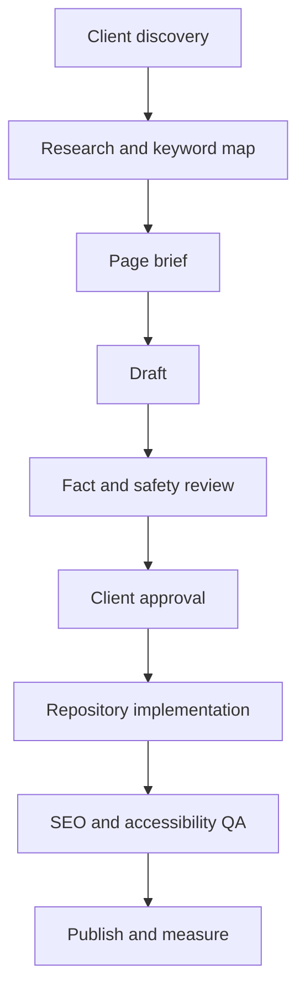

# Plumber Growth System — Content and SEO Strategy

## Document Control

| Field | Value |
|---|---|
| Project | Plumber Growth System |
| Document | Content and SEO Strategy |
| Document ID | 07-content-and-seo-strategy |
| Version | 1.0 |
| Status | Draft for Approval |
| Parent Documents | 00-project-overview.md through 06-design-system.md |
| Primary Market | United States plumbing companies |
| Primary Objectives | Local SEO, AEO, GEO, LLM visibility and conversion |

---

## 1. Purpose

This document defines how the Plumber Growth System will research, create, organize, verify, publish, and maintain website content.

It covers:

- Brand voice
- Plumbing content standards
- Keyword research
- Search intent
- Local SEO
- Service content
- Service-area content
- Answer-engine optimization
- Generative-engine optimization
- Entity clarity
- Internal linking
- Structured data
- Conversion copy
- Content verification
- Measurement
- Ongoing optimization

The strategy must produce useful client-specific websites rather than publishing the same generic plumbing content for every customer.

---

## 2. Strategic Objectives

Each client website should:

1. Explain what the plumbing company does.
2. Clarify where the company operates.
3. Establish legitimate business credibility.
4. Answer service-specific customer questions.
5. Capture calls and service requests.
6. support Google Business Profile relevance.
7. Create a clear business entity for search and answer systems.
8. Give search engines crawlable, internally linked content.
9. Help users choose the appropriate service.
10. Avoid thin, duplicate, or mass-generated pages.
11. Convert qualified visitors without making unsupported promises.
12. Provide measurable search and conversion performance.

---

## 3. Search Strategy Principles

### 3.1 People-first content

Content must primarily help potential plumbing customers.

It must not exist only to:

- Repeat keywords
- Manipulate rankings
- Create artificial geographic coverage
- Target every possible query variation
- Manufacture topical authority
- Inflate the site’s page count

Google defines people-first content as content created primarily for users rather than to manipulate rankings. It also warns that generating many low-value pages, regardless of whether they were produced by AI or humans, may constitute scaled-content abuse.

### 3.2 Client-specific evidence

Every client website should contain verified information that distinguishes the company, such as:

- Services actually offered
- Actual service areas
- Company history
- Owner or team experience
- Licenses
- Credentials
- Service process
- Emergency availability
- Financing
- Warranties
- Real reviews
- Real photography
- Community involvement
- Supported property types

### 3.3 One page, one primary purpose

Every indexable page needs:

- A defined audience
- A primary search intent
- A distinct topic
- A conversion objective
- A reason to exist independently
- Relevant internal links

### 3.4 Search visibility is not guaranteed

The system may improve technical quality, topical coverage, entity clarity, and conversion infrastructure, but it must not guarantee:

- Rankings
- Map-pack placement
- Rich results
- AI citations
- Featured snippets
- Leads
- Revenue

---

## 4. Terminology

### SEO

Search engine optimization for traditional organic search discovery and performance.

### Local SEO

Optimization for location-sensitive searches and local business discovery.

### AEO

Answer-engine optimization: structuring content so systems can understand and answer specific questions accurately.

### GEO

Generative-engine optimization: improving the clarity, credibility, structure, and retrievability of content for AI-generated answers.

### LLM visibility

The possibility that an AI system can discover, interpret, retrieve, summarize, or cite the business accurately.

These disciplines overlap. They should not result in separate duplicate pages for every search surface.

---

## 5. Brand Voice

The default content voice should be:

- Professional
- Direct
- Helpful
- Calm
- Knowledgeable
- Local
- Respectful
- Practical
- Reassuring
- Easy to understand

### Voice characteristics

Use:

- Short, clear explanations
- Active voice
- Familiar plumbing language
- Customer-centered outcomes
- Specific service information
- Transparent next steps
- Appropriate urgency
- Direct calls to action

Avoid:

- Empty superlatives
- Excessive technical jargon
- Aggressive sales language
- Fear-based copy
- Keyword-stuffed sentences
- Unsupported guarantees
- Artificial friendliness
- Generic “we care” paragraphs without evidence

---

## 6. Customer Language

### Preferred language

- Plumbing problem
- Service request
- Plumbing repair
- Estimate
- Appointment request
- Technician
- Service area
- Water leak
- Drain problem
- Water heater
- Sewer line
- Missed call
- Follow-up
- Customer review

### Technical terms requiring explanation

When used, explain terms such as:

- Hydro jetting
- Sewer camera inspection
- Tankless water heater
- Repiping
- Backflow
- Pressure regulator
- Trenchless repair
- Leak detection
- Cleanout

### Avoid as customer-facing language

- SaaS platform
- Automation stack
- Webhook
- Pipeline trigger
- GHL snapshot
- CRM object
- Conversion infrastructure
- Static deployment

---

## 7. Research Before Writing

Content must not begin with keyword generation alone.

Each client requires a discovery and evidence-gathering process.

### 7.1 Business research

Collect and verify:

- Public business name
- Legal business name
- Founding year
- Owner or leadership
- Physical location or service-area status
- Phone
- Email
- Hours
- Emergency availability
- Licenses
- Credentials
- Insurance or bonding claims
- Financing
- Warranties
- Associations
- Residential or commercial focus
- Service process
- Payment options

### 7.2 Service research

For each service, confirm:

- Whether it is offered
- Residential or commercial availability
- Emergency availability
- Equipment or methods used
- Common customer problems
- Service limitations
- Related services
- Geographic availability
- Required credentials
- Customer next step

### 7.3 Local research

Collect:

- Primary market
- Actual service areas
- ZIP codes where relevant
- Neighborhoods where relevant
- Housing or property characteristics
- Local water or infrastructure considerations
- Applicable licensing information
- Local terminology
- Customer questions
- Legitimate local proof

Do not invent local familiarity.

### 7.4 Competitor research

Analyze legitimate competitors for:

- Services
- Page architecture
- Content gaps
- Calls to action
- Review positioning
- Local coverage
- Common questions
- Search-result presentation

Do not copy competitor language or structure mechanically.

---

## 8. Keyword Research Process

Keyword research should occur for each client and market.

### Step 1: Establish service inventory

Create the verified list of services the client actually offers.

### Step 2: Establish geographic inventory

Create the verified list of locations the client serves.

### Step 3: Build seed topics

Examples:

- Plumber
- Emergency plumber
- Drain cleaning
- Water heater repair
- Leak detection
- Sewer-line repair
- Residential plumbing
- Commercial plumbing

### Step 4: Collect query evidence

Use appropriate sources such as:

- Google Search Console
- Bing Webmaster Tools
- Google Business Profile performance
- Paid search data where available
- Keyword research platforms
- Search suggestions
- People Also Ask
- Related searches
- Competitor coverage
- Customer calls and questions
- GHL conversation data
- Internal site-search data where available

### Step 5: Classify intent

Classify each meaningful query as:

- Transactional
- Commercial investigation
- Informational
- Navigational
- Local
- Emergency
- Existing-customer support

### Step 6: Group by customer need

Group queries by meaning rather than exact wording.

Example cluster:

- Water heater repair
- Fix water heater
- Water heater not heating
- No hot water plumber
- Water heater leaking

These may belong on one strong Water Heater Repair page rather than five thin pages.

### Step 7: Map clusters to pages

Every target cluster must map to:

- An existing page
- A planned page
- An FAQ
- A section within a page
- A rejected topic outside the client’s scope

### Step 8: Prevent cannibalization

Do not create multiple pages targeting the same primary intent without a meaningful audience, service, or geographic distinction.

---

## 9. Keyword Map

Maintain a structured map with:

| Field | Description |
|---|---|
| Page URL | Canonical route |
| Page type | Home, service, location, FAQ or supporting |
| Primary topic | Main page subject |
| Primary intent | Dominant user need |
| Primary query cluster | Closely related searches |
| Secondary topics | Supporting concepts |
| Geographic scope | Market or service area |
| Conversion goal | Call, request or supporting action |
| Internal links in | Pages expected to link here |
| Internal links out | Related destinations |
| Content status | Planned, drafted, approved or published |
| Evidence source | Research supporting the decision |

The keyword map is a planning tool, not a requirement to repeat every phrase verbatim.

---

## 10. Page-Level Search Strategy

| Page | Primary intent | Primary conversion |
|---|---|---|
| Homepage | Local plumber/company discovery | Call or request service |
| Services hub | Explore plumbing services | Choose a service |
| Service page | Solve a specific plumbing need | Request that service |
| Residential hub | Find homeowner plumbing support | Request residential service |
| Commercial hub | Find business plumbing support | Request commercial service |
| Service Areas hub | Confirm geographic coverage | Choose location or request service |
| Location page | Find plumbing help in an actual market | Call or request service |
| About | Verify company credibility | Contact or request service |
| Reviews | Evaluate customer experience | Request service |
| Financing | Understand payment options | Apply or request information |
| FAQs | Resolve common questions | Visit relevant service or request help |
| Contact | Reach the company | Submit general message |
| Request Service | Submit service information | Complete form |

---

## 11. Homepage Content Strategy

The homepage should target the business’s overall local plumbing entity, not every individual service equally.

### Homepage questions to answer

- Who is the company?
- What type of plumbing work does it perform?
- Where does it operate?
- Does it handle residential, commercial or both?
- Does it offer emergency service?
- Why should a customer trust it?
- How can a customer request help?
- What happens next?

### Homepage optimization

Use:

- One clear H1
- Primary-market context
- Priority services
- Verified trust signals
- Clear calls to action
- Local business information
- Internal links
- Concise FAQs
- Visible reviews

Avoid:

- Long lists of city names
- Every service in the H1
- Repeated exact-match phrases
- Unsupported “best plumber” claims
- Excessive homepage copy designed only for rankings

---

## 12. Service Hub Strategy

The Services hub should:

- Explain the client’s service categories
- Help visitors self-select
- Link to every enabled service
- Clarify residential and commercial availability
- Explain emergency options
- Provide an overview of the service process
- Link to service areas
- Direct visitors to Request Service

It must provide original connective value rather than only displaying cards.

---

## 13. Service Page Content Framework

Each service page should contain:

1. Breadcrumbs
2. Service-specific H1
3. Direct summary
4. Common symptoms or customer situations
5. What the service includes
6. Why professional evaluation may be necessary
7. Client-specific service process
8. Relevant methods or equipment
9. Residential or commercial context
10. Service-area context
11. Related services
12. Service-specific FAQs
13. Request-service call to action
14. Appropriate safety limitations

### Service-page quality test

The page should still be useful if:

- The city name is removed
- Exact-match keywords are removed
- Search engines do not exist

If the page loses all value under this test, it needs more substantive content.

---

## 14. Emergency Plumbing Content Strategy

Emergency content must balance urgency, safety, and accuracy.

### Content should explain

- What the company considers an emergency
- Which urgent services it offers
- Verified availability
- How to contact the company
- Information the customer should provide
- What happens after contact
- Situations requiring emergency services or utility assistance

### Prohibited claims unless verified

- Available 24/7
- Guaranteed immediate response
- Technician dispatched instantly
- Arrival within a fixed time
- Same-day service
- All emergencies handled

### Safety

Do not provide repair instructions involving:

- Gas systems
- Electrical hazards
- Contaminated water
- Structural danger
- Serious flooding risks

---

## 15. Residential Plumbing Strategy

Residential content should address:

- Homeowners
- Landlords where applicable
- Common household plumbing problems
- Fixtures
- Water heaters
- Drains
- Leaks
- Sewer lines
- Preventive considerations
- Scheduling expectations

The Residential Plumbing hub should organize residential needs without duplicating complete service pages.

---

## 16. Commercial Plumbing Strategy

Commercial content should be published only when verified.

Potential audiences include:

- Property managers
- Retail facilities
- Offices
- Restaurants
- Multifamily properties
- Light-industrial facilities

Do not claim specialized facility experience without evidence.

Commercial content should address:

- Scheduling
- Operational disruption
- Property types
- Communication
- Documentation
- Ongoing support
- Relevant services
- Service-area limitations

---

## 17. Service-Area Strategy

### Service Areas hub

The hub should establish:

- Primary operating market
- Actual geographic coverage
- General availability
- Location relationships
- Relevant service limitations

### Location-page threshold

A location page should be created only when:

- The client actually serves the location
- The location has strategic importance
- Sufficient unique information exists
- The page helps customers in that location
- The page does not imply a false office
- The page has internal links and a defined conversion role

### Location-page content sources

Use verified details such as:

- Services available in the location
- Neighborhoods
- ZIP codes
- Property types
- Local plumbing considerations
- Travel or availability expectations
- Client work history
- Location-specific FAQs
- Nearby service areas

### Prohibited location strategy

Do not generate large numbers of pages by replacing:

- City name
- State name
- ZIP code
- Heading
- Metadata

Google’s current spam guidance explicitly warns against scaled, low-value content produced primarily to influence rankings.

---

## 18. Local Entity Strategy

Each website should communicate one coherent business entity.

Maintain consistency for:

- Business name
- Address or service-area status
- Phone
- Website
- Hours
- Primary category
- Services
- Service areas
- Logo
- Social profiles
- Google Business Profile
- Licenses
- Founding information

### Entity references

Where legitimate, connect the business to:

- Google Business Profile
- Bing Places
- Apple Business Connect
- Facebook
- Industry associations
- Licensing authorities
- Financing providers
- Local chambers or organizations
- Trusted directories

Do not create or link to false profiles.

---

## 19. Google Business Profile Alignment

Website and GBP information should agree on:

- Business name
- Primary phone
- Website URL
- Business address or service-area status
- Hours
- Services
- Business description
- Appointment or service-request links
- Review destination

The website should support GBP performance but must not attempt to manipulate GBP through:

- Keyword-stuffed business names
- Fake locations
- Duplicate profiles
- Review gating
- Fabricated reviews
- Unsupported service areas

---

## 20. AEO Strategy

Answer-engine optimization should make information easy to identify and extract.

### Content structure

Use:

- Descriptive headings
- Direct opening answers
- Short definitions
- Ordered steps
- Bulleted lists
- Comparison tables when useful
- Question-and-answer sections
- Clear entity names
- Explicit service-area statements
- Visible updated information

### Answer pattern

For important questions:

1. Give the direct answer.
2. Explain relevant conditions.
3. Clarify limitations.
4. Provide the next action.

### Example

Question:

> Is a leaking water heater an emergency?

Answer structure:

> A leaking water heater may require urgent attention when water is spreading, electrical components are involved, or the tank appears damaged. Shutoff and safety steps depend on the equipment and conditions, so contact a qualified plumbing professional. If there is an immediate electrical, fire, gas, or life-safety danger, contact the appropriate emergency service or utility provider.

Client-specific content must not exceed verified professional scope.

---

## 21. GEO and LLM Visibility Strategy

Content intended to be accurately interpreted by generative systems should emphasize:

- Clear business identity
- Explicit relationships
- Consistent facts
- Specific service descriptions
- Transparent limitations
- Verifiable credentials
- Source attribution
- Structured headings
- Stable URLs
- Crawlable HTML
- Internal linking
- Structured data matching visible content
- Original client evidence

### Useful sentence patterns

- “[Business Name] is a plumbing company serving [verified area].”
- “The company provides [verified services].”
- “Emergency service is available [verified availability].”
- “Customers can request service by [verified method].”
- “[Credential] was verified from [appropriate source].”

### Do not create separate AI-only content

Google’s current AI-search guidance does not require special duplicate pages for generative search. Helpful, technically accessible content remains the foundation.

Do not create pages for every possible conversational query variation.

---

## 22. FAQ Strategy

FAQs should come from:

- Customer calls
- GHL conversations
- Search query data
- Sales objections
- Technician input
- Existing customer questions
- Service-specific research

### FAQ placement

Use:

- Service-specific FAQs on service pages
- Location-specific FAQs on qualified location pages
- Broad company and scheduling FAQs on `/faqs/`
- Emergency warnings outside collapsed FAQ controls

### FAQ answer requirements

Each answer should:

- Respond directly
- Remain concise
- Include conditions
- Avoid guarantees
- Link to a relevant service
- Use verified client policy
- Avoid unsafe instructions

### FAQ schema

FAQ structured data may be added only when:

- Questions and answers are visible
- Markup matches visible content
- The page and content comply with current eligibility policies

Structured data may help systems understand content, but it does not guarantee rich-result presentation.

---

## 23. People Also Ask Strategy

PAA research may identify recurring customer questions, but it should not cause uncontrolled page creation.

Use PAA questions to improve:

- Service-page sections
- FAQ answers
- Content briefs
- Internal links
- Sales messaging
- GHL automated responses

Create a standalone page only when the topic has sufficient depth, distinct intent, and customer value.

---

## 24. Conversion Copy Strategy

### Primary calls to action

- Request Plumbing Service
- Request an Estimate
- Call [Business Name]
- Submit an Emergency Request
- Schedule a Service Request
- Ask a Plumbing Question

Use “schedule” carefully when the form creates only a request.

### Call-to-action requirements

Every CTA should explain:

- What the visitor is doing
- What information is required
- What happens next
- Whether the appointment is requested or confirmed
- Whether immediate response is guaranteed

### Avoid

- Get Service Now, when not guaranteed
- Technician on the Way
- Instant Appointment, when untrue
- Guaranteed Lowest Price
- Best Plumber in [City]
- Number One Plumbing Company

---

## 25. Title Strategy

Every indexable page must have a distinct HTML title.

### Recommended patterns

Homepage:

```text
Plumber in [Primary Market] | [Business Name]
```

Service:

```text
[Service] in [Primary Market] | [Business Name]
```

Location:

```text
Plumbing Services in [Location] | [Business Name]
```

About:

```text
About [Business Name] | Plumbing Company in [Market]
```

### Requirements

Titles should:

* Describe the page accurately
* Use the business name
* Include location when useful
* Avoid keyword repetition
* Avoid boilerplate that obscures the topic
* Remain readable

Google may generate title links from multiple page signals, so headings, titles, and visible content should remain aligned.

---

## 26. Meta Description Strategy

Descriptions should:

* Summarize the page
* Include the relevant service or market naturally
* Communicate a differentiator
* Include an appropriate action
* Avoid unsupported claims
* Remain distinct across important pages

Descriptions influence presentation but are not guaranteed to be used verbatim.

---

## 27. Heading Strategy

Each page should have:

* One primary H1
* Logical H2 sections
* H3 elements nested under relevant H2 sections
* Descriptive headings
* No heading levels selected only for visual size

Avoid:

* Multiple competing H1 elements
* Repeating the exact page title as every heading
* Keyword-stuffed headings
* Empty headings
* Generic headings such as “More Information”

---

## 28. Internal-Linking Strategy

Internal links should help users navigate between related needs.

### Service links

Connect:

* Service hubs to detail pages
* Detail pages to related services
* Emergency content to the Emergency Request form
* Service pages to relevant FAQs
* Service pages to applicable locations

### Location links

Connect:

* Service Areas hub to approved location pages
* Location pages to services available there
* Nearby legitimate locations where useful
* Location pages to Request Service

### Conversion links

Every major marketing page should provide a path to:

* Call
* Request Service
* Contact
* Emergency Request when applicable

### Anchor text

Use descriptive natural language.

Prefer:

* Water heater repair services
* Request drain-cleaning service
* Plumbing services in Henderson

Avoid repetitive exact-match anchors across every page.

---

## 29. Structured Data Strategy

Potential schema includes:

* `WebSite`
* `Organization`
* `Plumber`
* `LocalBusiness`
* `Service`
* `WebPage`
* `AboutPage`
* `ContactPage`
* `CollectionPage`
* `BreadcrumbList`
* `FAQPage` when eligible

### Structured data requirements

Markup must:

* Match visible content
* Use canonical URLs
* Use verified business data
* Reflect enabled services
* Reflect actual service areas
* Avoid fabricated ratings
* Avoid unsupported price claims
* Avoid false office locations
* Validate before release

Structured data helps search engines understand page content but does not guarantee rich-result eligibility or display.

---

## 30. Review Content Strategy

Use only legitimate reviews or testimonials.

For every published review, retain:

* Source
* Original wording
* Publication permission when required
* Customer attribution
* Rating when legitimately provided
* Date when appropriate

Do not:

* Invent testimonials
* Rewrite reviews to change meaning
* Combine several reviews
* Add an unsupported rating
* Publish private feedback without consent
* Mark up self-serving aggregate ratings without confirming eligibility

---

## 31. Image SEO Strategy

Images should have:

* Descriptive filenames
* Accurate alternative text
* Relevant surrounding copy
* Defined dimensions
* Responsive sources
* Compressed formats
* Client-specific relevance

Example filename:

```text
business-name-water-heater-installation-city-state.webp
```

Alternative text should describe the image’s function and content, not repeat keywords unnecessarily.

Decorative images should use empty alternative text.

---

## 32. Content Verification Matrix

Before publishing, verify:

| Claim                  | Required verification                |
| ---------------------- | ------------------------------------ |
| Business name          | Client and official business records |
| Address                | Client and GBP                       |
| Phone                  | Live test and client confirmation    |
| Hours                  | Client confirmation                  |
| Service area           | Client confirmation                  |
| Services               | Client confirmation                  |
| Emergency availability | Written client confirmation          |
| 24/7 availability      | Written client confirmation          |
| License                | Appropriate authority                |
| Insurance or bonding   | Client documentation                 |
| Years in business      | Official records or documentation    |
| Financing              | Provider documentation               |
| Warranty               | Written client terms                 |
| Review                 | Original source                      |
| Team biography         | Named person’s approval              |
| Association membership | Association source                   |

Unverified claims must be omitted or clearly marked for internal review—not published as fact.

---

## 33. AI-Assisted Content Workflow

AI may assist with:

* Research organization
* Content outlines
* Drafting
* Rewriting
* FAQ clustering
* Internal-link suggestions
* Metadata alternatives
* Schema generation
* Content QA

AI must not independently determine:

* Services offered
* Service areas
* Licenses
* Credentials
* Warranties
* Emergency availability
* Pricing
* Reviews
* Business history
* Legal claims

### Required human review

Before publication:

1. Verify facts.
2. Remove unsupported claims.
3. Add client-specific evidence.
4. Review plumbing accuracy.
5. Review safety language.
6. Review local relevance.
7. Review conversion intent.
8. Review duplication.
9. Obtain client approval.
10. Run technical QA.

AI-generated volume is not a substitute for original value. Google’s current guidance warns that using generative tools to create many low-value pages may violate scaled-content-abuse policies.

---

## 34. Content Brief Requirements

Every indexable page requires a brief containing:

* Page name
* URL
* Page type
* Audience
* Primary intent
* Primary topic
* Supporting topics
* Geographic scope
* Customer questions
* Required verified facts
* Differentiating evidence
* Proposed outline
* Internal links in
* Internal links out
* Primary CTA
* Secondary CTA
* Metadata direction
* Schema direction
* Required images
* Compliance considerations
* Approval status

Claude Code should not invent missing client facts while implementing content.

---

## 35. Content Production Workflow



---

## 36. Technical SEO Requirements

The website must support:

* Crawlable HTML
* Mobile content parity
* Canonical URLs
* XML sitemap
* Robots directives
* Indexation controls
* Redirects
* Structured data
* Breadcrumbs
* Descriptive titles
* Descriptive headings
* Internal links
* Useful status behavior
* Fast rendering
* Image optimization
* Preview-environment blocking

Google uses mobile content for indexing, so important content and structured data must not disappear on mobile.

---

## 37. Sitemap Strategy

The sitemap should include only:

* Canonical URLs
* Indexable pages
* Enabled services
* Approved location pages
* Current production URLs

Exclude:

* Client Onboarding
* Thank You
* Review Feedback
* Emergency Request form
* Disabled pages
* Redirects
* Preview deployments
* Duplicate variants

A sitemap helps discovery but does not guarantee crawling or indexing.

---

## 38. Robots and Noindex Strategy

Use robots controls intentionally.

### `noindex, follow`

Recommended for:

* Emergency Request form
* Review Feedback form
* Thin Request Service page if it lacks standalone search value
* Thank You page

### `noindex, nofollow`

Recommended for:

* Client Onboarding
* Private or tokenized workflows

Do not rely on `robots.txt` to secure sensitive content. Private onboarding content requires actual access control.

---

## 39. Search Platform Setup

Each launched client website should be prepared for:

* Google Search Console
* Bing Webmaster Tools
* Google Business Profile website connection
* Bing Places where appropriate
* Apple Business Connect where appropriate
* XML sitemap submission
* Analytics
* Conversion tracking

Search-platform access should be granted through secure invitations rather than shared passwords.

---

## 40. Content Maintenance

Review content when:

* Services change
* Service areas change
* Hours change
* Licensing changes
* Financing changes
* Staff changes
* Warranties change
* Search performance reveals gaps
* Customers ask recurring questions
* Platform policies change
* Content becomes outdated

### Recommended review cycle

* Business information: quarterly
* Service information: semiannually
* Emergency and safety language: quarterly
* Reviews and testimonials: monthly or quarterly
* Search performance: monthly
* Full content audit: annually

---

## 41. Measurement Framework

Track:

### Visibility

* Indexed pages
* Organic impressions
* Search queries
* Average position as directional context
* Local visibility
* Branded and non-branded searches
* Search-engine crawl issues

### Engagement

* Service-page visits
* Location-page visits
* Click-to-call
* Request-service views
* Form starts
* Form completions
* Chat engagement
* FAQ interactions

### Conversion

* General quote submissions
* Emergency submissions
* Calls
* Appointment requests
* Qualified opportunities
* Won opportunities where tracked
* Review-link clicks

### Content quality

* Pages with no impressions
* Duplicate intent
* High-exit pages
* Search queries without useful landing pages
* Outdated content
* Unsupported claims
* Broken links
* Missing internal links

Do not judge content solely by traffic. Some pages serve qualification, trust, or conversion roles.

---

## 42. Content and SEO Acceptance Criteria

The strategy is ready for implementation when:

1. Every indexable page has a distinct intent.
2. Services and locations are verified.
3. A client-specific keyword map exists.
4. Every page has an approved content brief.
5. Primary facts have documented sources.
6. Location pages meet the uniqueness threshold.
7. Emergency claims are verified.
8. Titles and descriptions are distinct.
9. Internal links are mapped.
10. Structured data matches visible content.
11. Review content is legitimate.
12. AI-assisted content receives human review.
13. Mobile content contains all important information.
14. Sitemap and indexation rules are implemented.
15. Search and conversion measurement is configured.
16. No page is generated only to target a minor query variation.

---

## 43. Open Decisions

The following remain unresolved:

* Final keyword research toolset
* Final analytics platform
* Final rank-tracking platform
* Whether blog or resource publishing will be introduced
* Included service-page count
* Included location-page count
* Content-update frequency within the base plan
* Responsibility for ongoing Search Console monitoring
* Client approval workflow
* Whether technician review is required for advanced service content
* Final local citation-management scope
* Whether IndexNow will be implemented
* Final AI-crawler policy

---

## 44. Current Guidance References

This strategy should be reviewed periodically against current official guidance:

* Google Search Essentials
* Google SEO Starter Guide
* Google helpful-content guidance
* Google spam policies
* Google generative-AI content guidance
* Google AI-search optimization guidance
* Google structured-data policies
* Google mobile-first indexing guidance
* Google sitemap and robots documentation
* Bing Webmaster guidance
* Schema.org vocabulary

---

## 45. Next Document

The next project document is:

`08-nextjs-form-specifications.md`

It will define:

* Exact fields for all five forms
* Validation rules
* Conditional behavior
* Consent requirements
* Accessibility behavior
* GHL field mapping
* Opportunity routing
* Workflow triggers
* Error responses
* Analytics events
* Test cases
