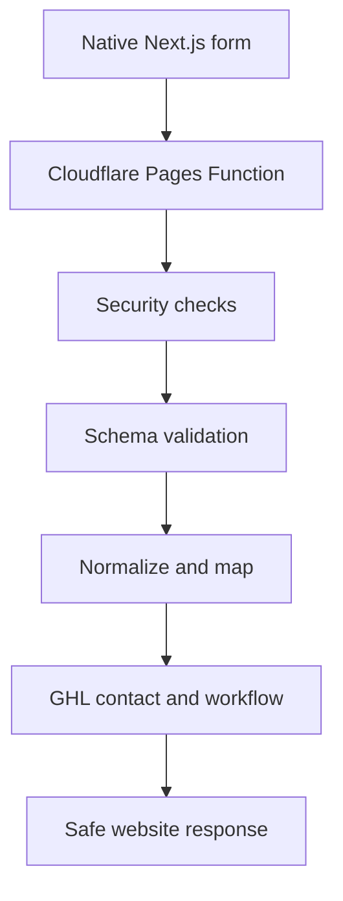

# Plumber Growth System — Next.js Form Specifications

## Document Control

| Field | Value |
|---|---|
| Project | Plumber Growth System |
| Document | Next.js Form Specifications |
| Document ID | 08-nextjs-form-specifications |
| Version | 1.0 |
| Status | Draft for Approval |
| Parent Documents | 00-project-overview.md through 07-content-and-seo-strategy.md |
| Form Platform | Native Next.js forms |
| Server Processing | Cloudflare Pages Functions |
| CRM Destination | GoHighLevel |

---

## 1. Purpose

This document defines the complete implementation requirements for the five native Next.js forms used by the Plumber Growth System:

1. General Plumbing Quote Request
2. Emergency Plumbing Request
3. Contact Form
4. Review Feedback Form
5. Website Onboarding Form

It establishes:

- Field names
- Data types
- Validation
- Conditional behavior
- Consent
- Accessibility
- Server processing
- GHL mapping
- Opportunity routing
- Workflow triggers
- Error responses
- Analytics
- Security requirements
- Test cases

These forms must not use GHL Form Builder or GHL Survey Builder.

---

## 2. Form Inventory

| Form | Public | Primary purpose | Creates opportunity |
|---|---:|---|---:|
| General Plumbing Quote Request | Yes | Capture standard plumbing inquiries | Yes |
| Emergency Plumbing Request | Yes | Capture urgent plumbing inquiries | Yes, high priority |
| Contact Form | Yes | Capture general messages | Conditional |
| Review Feedback Form | Yes or customer-directed | Collect private feedback | No sales opportunity |
| Website Onboarding Form | Paying clients only | Collect implementation data | Fulfillment record only |

---

## 3. Shared Architecture



### Approved request endpoints

```text
POST /api/forms/general-quote
POST /api/forms/emergency-request
POST /api/forms/contact
POST /api/forms/review-feedback
POST /api/forms/website-onboarding
```

A catch-all Cloudflare Function may route these paths internally, but only approved form identifiers may be accepted.

---

## 4. Shared Submission Envelope

Every submission must include a server-generated or verified submission envelope.

```ts
interface FormSubmissionEnvelope {
  formType:
    | "general-quote"
    | "emergency-request"
    | "contact"
    | "review-feedback"
    | "website-onboarding";
  submissionId: string;
  idempotencyKey: string;
  submittedAt: string;
  pageUrl: string;
  referrer?: string;
  userAgentCategory?: string;
  attribution: AttributionData;
  turnstileToken?: string;
}
```

### Attribution data

```ts
interface AttributionData {
  source?: string;
  medium?: string;
  campaign?: string;
  term?: string;
  content?: string;
  gclid?: string;
  gbraid?: string;
  wbraid?: string;
  fbclid?: string;
  landingPage?: string;
  referrer?: string;
}
```

Do not send personal form values into analytics platforms.

---

## 5. Shared Security Requirements

Every public endpoint must perform:

1. Method validation
2. Content-type validation
3. Request-size enforcement
4. Origin and host validation
5. Rate-limit evaluation
6. Honeypot evaluation
7. Turnstile verification
8. Schema validation
9. Input normalization
10. Idempotency evaluation
11. GHL mapping
12. Safe error handling
13. Structured logging

### Prohibited behavior

Forms must not:

* Expose GHL credentials
* Expose private webhook URLs
* Trust hidden browser values without validation
* Forward arbitrary fields directly to GHL
* Accept scripts or executable markup
* Store passwords
* Collect card information
* Report success before server acceptance
* Send personal information into analytics events

---

## 6. Shared Accessibility Requirements

Every form must provide:

* A descriptive form heading
* A concise purpose statement
* Persistent labels
* Programmatic label associations
* Required-field indicators
* Appropriate autocomplete attributes
* Appropriate `inputmode`
* Logical tab order
* Keyboard-accessible controls
* Field-level error messages
* Error summary after failed submission
* Focus movement to the error summary
* Live-region status updates
* Visible focus styles
* Loading-state announcement
* Success-state announcement
* Sufficient color contrast
* No dependence on placeholder text
* No dependence on color alone

### Error-summary behavior

When server or client validation fails:

1. Display a summary above the form.
2. State the number of fields requiring attention.
3. Link each error to the corresponding field.
4. Move focus to the summary.
5. Preserve valid entered values.

---

## 7. Shared Interaction Requirements

### Submission button

While submitting:

* Disable repeated activation
* Display a loading state
* Preserve button width
* Announce submission progress
* Prevent accidental duplicate requests

### Success behavior

After server acceptance:

* Display a form-specific confirmation
* Explain the next step
* Display the verified business phone number
* Clear sensitive form state
* Fire the approved conversion event
* Avoid exposing form values in the URL

### Failure behavior

If GHL or the processing endpoint cannot accept the request:

> We couldn’t submit your request online. Please call [Business Name] at [Phone Number].

Emergency requests should emphasize calling the verified business number while retaining appropriate emergency-safety guidance.

---

## 8. Shared Validation Standards

### Names

* Trim leading and trailing whitespace
* Minimum 1 meaningful character
* Maximum 80 characters
* Permit legitimate punctuation, spaces and Unicode letters
* Do not assume all names follow a first-name/last-name convention internally

### Email

* Maximum 254 characters
* Normalize case
* Reject obvious malformed values
* Do not attempt to determine deliverability in the browser

### US phone

* Accept common presentation formats
* Normalize server-side to E.164 when possible
* Require a valid US telephone number where phone is mandatory
* Do not expose normalized values back to the URL

### Free-text fields

* Normalize whitespace
* Enforce maximum length
* Remove control characters
* Preserve customer meaning
* Reject executable markup
* Do not render submitted content as HTML

### ZIP codes

Accept:

```text
12345
12345-6789
```

Normalize to the appropriate stored representation.

### Dates

* Use ISO date values internally
* Do not permit impossible dates
* Do not represent a preferred date as a confirmed appointment

---

# 9. General Plumbing Quote Request

## 9.1 Component

```text
GeneralQuoteForm
```

## 9.2 Endpoint

```text
POST /api/forms/general-quote
```

## 9.3 Primary page

```text
/request-service/
```

## 9.4 Purpose

Capture standard residential or commercial plumbing inquiries and route them into the Plumbing Lead Pipeline.

## 9.5 Fields

> **Note (deviation from QUOTE-001 — see docs/18 FORM-006):** Email, Street
> address, Address line 2, City, State, and ZIP code were removed from this form.
> It now captures phone as the only contact channel, so Preferred contact is
> Phone or Text only (Email removed). Property address and email are collected
> later by the team, not on this form.

| Field               | Type            |    Required | Validation                |
| ------------------- | --------------- | ----------: | ------------------------- |
| First name          | Text            |         Yes | 1–80 characters           |
| Last name           | Text            |         Yes | 1–80 characters           |
| Mobile phone        | Tel             |         Yes | Valid US phone            |
| Customer type       | Select or radio |         Yes | Residential or Commercial |
| Plumbing service    | Select          |         Yes | Approved enabled service  |
| Problem description | Textarea        |         Yes | 10–2,000 characters       |
| Preferred date      | Date            |          No | Today or future           |
| Preferred time      | Select          |          No | Approved configured value |
| Preferred contact   | Radio           |         Yes | Phone or Text             |
| Existing customer   | Radio           |          No | Yes, No or Unsure         |
| Service consent     | Checkbox        | Conditional | See consent section       |
| Marketing consent   | Checkbox        |          No | Separate and unchecked    |
| Honeypot            | Text            |          No | Must remain empty         |
| Attribution         | Hidden data     |          No | Server validated          |
| Turnstile token     | Token           |         Yes | Server verified           |

## 9.6 Plumbing service options

Generate options from enabled client services.

Potential values:

```text
emergency-plumbing
drain-cleaning
water-heater-repair
water-heater-installation
leak-detection
pipe-repair
sewer-line-repair
toilet-repair
faucet-repair
garbage-disposal-repair
commercial-plumbing
other
```

The server must reject disabled or unknown values.

## 9.7 Query-based preselection

The page may accept:

```text
/request-service/?service=drain-cleaning
```

Requirements:

* Validate against enabled services
* Preselect only an approved value
* Ignore unsupported values
* Do not insert raw query content into the page

## 9.8 GHL contact behavior

Create or update the contact using normalized phone or email.

Map:

* Name
* Phone
* Email
* Address
* Customer type
* Plumbing service
* Problem description
* Preferred date
* Preferred time
* Preferred contact method
* Existing-customer status
* Attribution
* Consent timestamp
* Consent source

## 9.9 Opportunity behavior

Create an opportunity:

| Property       | Value                        |
| -------------- | ---------------------------- |
| Pipeline       | Plumbing Lead Pipeline       |
| Stage          | New Lead                     |
| Status         | Open                         |
| Name           | `[Service] — [Contact Name]` |
| Source         | Website — General Quote      |
| Monetary value | Blank unless manually added  |
| Priority       | Normal                       |

## 9.10 Tags

Apply:

```text
website-lead
general-quote-request
service-[service-slug]
```

## 9.11 Workflow triggers

Trigger:

* General Website Lead Intake
* Immediate Lead Acknowledgment
* Internal New Lead Notification
* Standard No-Response Follow-Up

## 9.12 Customer confirmation

> Thank you, [First Name]. [Business Name] received your plumbing service request. A member of the team will review the information and contact you using your preferred method. Your requested date is not confirmed until the company contacts you.

## 9.13 Analytics event

```text
general_quote_submit
```

Allowed properties:

* Service slug
* Customer type
* Page path
* UTM campaign
* Success category

---

# 10. Emergency Plumbing Request

## 10.1 Component

```text
EmergencyRequestForm
```

## 10.2 Endpoint

```text
POST /api/forms/emergency-request
```

## 10.3 Primary page

```text
/emergency-plumbing-request/
```

## 10.4 Purpose

Capture urgent plumbing requests, identify immediate safety concerns, and notify the plumbing company without guaranteeing dispatch.

## 10.5 Required safety notice

Display before the form:

> Submitting this form does not guarantee immediate service or confirm that a technician has been dispatched. If there is a gas odor, fire, electrical danger, serious injury, or another immediate threat to life or property, leave the affected area and contact the appropriate emergency service or utility provider.

## 10.6 Fields

| Field                 | Type        |    Required | Validation          |
| --------------------- | ----------- | ----------: | ------------------- |
| First name            | Text        |         Yes | 1–80 characters     |
| Last name             | Text        |         Yes | 1–80 characters     |
| Mobile phone          | Tel         |         Yes | Valid US phone      |
| Email                 | Email       |          No | Valid when provided |
| Emergency type        | Select      |         Yes | Approved value      |
| Active flooding       | Radio       |         Yes | Yes, No or Unsure   |
| Water shut off        | Radio       |         Yes | Yes, No or Unsure   |
| Gas odor              | Radio       |         Yes | Yes, No or Unsure   |
| Electrical danger     | Radio       |         Yes | Yes, No or Unsure   |
| Street address        | Text        |         Yes | 3–150 characters    |
| Address line 2        | Text        |          No | Maximum 100         |
| City                  | Text        |         Yes | 2–100 characters    |
| State                 | Select      |         Yes | Approved value      |
| ZIP code              | Text        |         Yes | Valid US ZIP        |
| Problem description   | Textarea    |         Yes | 10–2,000 characters |
| Preferred contact     | Radio       |         Yes | Phone or Text       |
| Safety acknowledgment | Checkbox    |         Yes | Must be true        |
| Service consent       | Checkbox    | Conditional | See consent section |
| Honeypot              | Text        |          No | Must remain empty   |
| Attribution           | Hidden data |          No | Server validated    |
| Turnstile token       | Token       |         Yes | Server verified     |

## 10.7 Emergency type options

Potential approved values:

```text
active-water-leak
burst-pipe
sewer-backup
overflowing-fixture
no-water
no-hot-water
water-heater-leak
gas-odor
other-urgent-plumbing
```

Client configuration must control which services are offered.

## 10.8 Conditional safety behavior

### Gas odor: Yes or Unsure

Immediately display:

> Leave the affected area and contact the appropriate gas utility or emergency service from a safe location. Do not rely on this website form for an immediate gas-related emergency response.

The form may remain available to record the request, but the safety message and emergency contact direction must take priority.

### Electrical danger: Yes or Unsure

Display:

> If water is near electrical equipment or there is an immediate electrical danger, avoid the affected area and contact the appropriate emergency service or qualified utility provider.

### Active flooding: Yes

Display the verified company phone action prominently without providing unsafe repair instructions.

## 10.9 GHL contact behavior

Create or update:

* Contact identity
* Phone and email
* Property address
* Emergency type
* Flooding status
* Water-shutoff status
* Gas-odor status
* Electrical-danger status
* Problem description
* Preferred contact
* Attribution
* Safety acknowledgment
* Consent record

## 10.10 Opportunity behavior

Create:

| Property | Value                                        |
| -------- | -------------------------------------------- |
| Pipeline | Plumbing Lead Pipeline                       |
| Stage    | New Lead                                     |
| Status   | Open                                         |
| Name     | `URGENT — [Emergency Type] — [Contact Name]` |
| Source   | Website — Emergency Request                  |
| Priority | High                                         |

Do not assign a monetary value automatically.

## 10.11 Tags

Apply:

```text
website-lead
emergency-plumbing-request
priority-urgent
emergency-[emergency-type]
```

## 10.12 Workflow triggers

Trigger:

* Emergency Request Intake
* Emergency Internal Notification
* Emergency Request Acknowledgment

Do not trigger:

* Slow lead nurture
* Promotional campaign
* Automatic dispatch confirmation
* Appointment confirmation without human action

## 10.13 Internal notification

Include:

* Contact name
* Mobile phone
* Emergency type
* Address
* Flooding status
* Water shutoff status
* Gas odor status
* Electrical danger status
* Problem description
* Submission time
* Direct contact action

## 10.14 Customer confirmation

> [Business Name] received your emergency plumbing request. This message does not confirm technician availability or dispatch. Please call [Phone Number] for the fastest available response. If there is an immediate danger involving gas, fire, electricity, serious injury, life, or property, contact the appropriate emergency service or utility provider.

## 10.15 Analytics event

```text
emergency_request_submit
```

Allowed properties:

* Emergency type
* Page path
* UTM campaign
* Success category

Do not send safety answers or the property address to analytics.

---

# 11. Contact Form

## 11.1 Component

```text
ContactForm
```

## 11.2 Endpoint

```text
POST /api/forms/contact
```

## 11.3 Primary page

```text
/contact/
```

## 11.4 Purpose

Capture general messages that may or may not represent a plumbing sales opportunity.

## 11.5 Fields

| Field             | Type        |    Required | Validation                   |
| ----------------- | ----------- | ----------: | ---------------------------- |
| First name        | Text        |         Yes | 1–80 characters              |
| Last name         | Text        |         Yes | 1–80 characters              |
| Email             | Email       |         Yes | Valid email                  |
| Phone             | Tel         |          No | Valid when provided          |
| Subject           | Select      |         Yes | Approved value               |
| Message           | Textarea    |         Yes | 10–2,000 characters          |
| Preferred contact | Radio       |         Yes | Email, Phone or Text         |
| Service consent   | Checkbox    | Conditional | Required for requested texts |
| Marketing consent | Checkbox    |          No | Separate and unchecked       |
| Honeypot          | Text        |          No | Must remain empty            |
| Attribution       | Hidden data |          No | Server validated             |
| Turnstile token   | Token       |         Yes | Server verified              |

## 11.6 Subject options

```text
plumbing-service-question
existing-appointment
existing-customer-support
billing-question
financing-question
vendor-inquiry
employment-inquiry
general-question
other
```

## 11.7 Opportunity classification

Create a sales opportunity automatically only for:

```text
plumbing-service-question
financing-question
```

Do not automatically create a sales opportunity for:

```text
existing-appointment
existing-customer-support
billing-question
vendor-inquiry
employment-inquiry
general-question
other
```

These messages may create tasks or internal notifications instead.

## 11.8 Tags

Apply:

```text
website-contact
contact-subject-[subject]
```

## 11.9 Workflow routing

Route according to subject:

| Subject                   | Workflow                          |
| ------------------------- | --------------------------------- |
| Plumbing service question | Service Inquiry Intake            |
| Existing appointment      | Existing Appointment Notification |
| Existing customer support | Customer Support Notification     |
| Billing question          | Billing Notification              |
| Financing question        | Financing Inquiry                 |
| Vendor inquiry            | Administrative Notification       |
| Employment inquiry        | Employment Inquiry Notification   |
| General or other          | General Contact Notification      |

## 11.10 Customer confirmation

> Thank you for contacting [Business Name]. Your message was received and will be routed to the appropriate team member. If you need plumbing service, you may receive a faster response by using the Request Service form or calling [Phone Number].

## 11.11 Analytics event

```text
contact_submit
```

Allowed properties:

* Subject category
* Page path
* Success category

---

# 12. Review Feedback Form

## 12.1 Component

```text
ReviewFeedbackForm
```

## 12.2 Endpoint

```text
POST /api/forms/review-feedback
```

## 12.3 Primary page

```text
/review-feedback/
```

## 12.4 Purpose

Collect private customer feedback, identify service-recovery needs, and record testimonial permission without review gating.

## 12.5 Fields

| Field                   | Type        |    Required | Validation                         |
| ----------------------- | ----------- | ----------: | ---------------------------------- |
| First name              | Text        |         Yes | 1–80 characters                    |
| Last name               | Text        |          No | 0–80 characters                    |
| Email                   | Email       | Conditional | Email or phone required            |
| Phone                   | Tel         | Conditional | Email or phone required            |
| Service date            | Date        |          No | Today or earlier                   |
| Technician name         | Text        |          No | Maximum 100                        |
| Rating                  | Radio group |         Yes | Integer 1–5                        |
| Feedback                | Textarea    |         Yes | 5–2,000 characters                 |
| Permission to contact   | Checkbox    |          No | Boolean                            |
| Testimonial permission  | Checkbox    |          No | Boolean                            |
| Testimonial attribution | Select      | Conditional | Required if testimonial permission |
| Honeypot                | Text        |          No | Must remain empty                  |
| Attribution             | Hidden data |          No | Server validated                   |
| Turnstile token         | Token       |         Yes | Server verified                    |

## 12.6 Testimonial attribution options

If testimonial permission is granted:

```text
first-name-and-last-initial
first-name-only
anonymous-customer
```

Testimonial permission must not be preselected.

## 12.7 Public review option

The verified Google review link must be available:

* Before submitting private feedback, or
* On the page independently of the private rating, and
* After submission regardless of rating

Do not condition the public-review link on a four- or five-star response.

## 12.8 GHL behavior

Create or update the contact when sufficient identity is provided.

Store:

* Service date
* Technician name
* Private-feedback rating
* Private-feedback text
* Permission to contact
* Testimonial permission
* Approved attribution
* Submission date

## 12.9 Tags

Apply:

```text
customer-feedback-submitted
private-rating-[rating]
testimonial-consent-yes
```

Apply `testimonial-consent-yes` only when explicitly selected.

## 12.10 Recovery routing

For a configured low-rating threshold, initially 1–3:

* Notify designated company users
* Create a customer-recovery task
* Do not publish the feedback
* Do not send promotional messages
* Do not hide the public-review option

For ratings 4–5:

* Thank the customer
* Record feedback
* Do not automatically publish without consent
* Keep the same public-review option available

## 12.11 Customer confirmation

> Thank you for sharing your feedback with [Business Name]. Your comments were received. If you gave permission to be contacted, a team member may follow up with you.

Public review action:

> You may also share an honest public review of your experience.

## 12.12 Analytics event

```text
review_feedback_submit
```

Allowed properties:

* Submission success
* Testimonial consent status

Do not send:

* Rating
* Feedback
* Name
* Phone
* Email
* Technician name

to general analytics.

---

# 13. Website Onboarding Form

## 13.1 Component

```text
WebsiteOnboardingForm
```

## 13.2 Endpoint

```text
POST /api/forms/website-onboarding
```

## 13.3 Primary page

```text
/client-onboarding/
```

## 13.4 Access

This form is for paying clients.

Production access should require one of:

* Signed single-use link
* Expiring client token
* Authenticated client session

A public unprotected onboarding form is not approved for production.

## 13.5 Indexation

Required:

```text
noindex, nofollow
```

Actual access control is required. Robots directives are not security controls.

## 13.6 Password warning

Display prominently:

> Do not enter passwords, recovery codes, private API keys, payment-card information, Social Security numbers, or other sensitive credentials in this form. Access to domains and business platforms will be requested through secure invitations.

## 13.7 Section A: Business information

| Field                      |    Required | Validation                            |
| -------------------------- | ----------: | ------------------------------------- |
| Legal business name        |         Yes | 2–150 characters                      |
| Public business name       |         Yes | 2–150 characters                      |
| Owner name                 |         Yes | 2–150 characters                      |
| Primary contact name       |         Yes | 2–150 characters                      |
| Primary contact email      |         Yes | Valid email                           |
| Primary contact phone      |         Yes | Valid US phone                        |
| Business phone             |         Yes | Valid US phone                        |
| Business email             |         Yes | Valid email                           |
| Founding year              |          No | Reasonable four-digit year            |
| Business description       |         Yes | 50–2,000 characters                   |
| Street address             | Conditional | Based on display model                |
| City                       |         Yes | 2–100 characters                      |
| State                      |         Yes | Approved state                        |
| ZIP code                   | Conditional | Valid ZIP                             |
| Address display preference |         Yes | Full address or service-area business |

## 13.8 Section B: Hours and availability

| Field                       |    Required |
| --------------------------- | ----------: |
| Business hours for each day |         Yes |
| Emergency service offered   |         Yes |
| 24/7 service offered        | Conditional |
| After-hours process         | Conditional |
| Holiday-hours process       |          No |
| Scheduling limitations      |          No |

The interface must explain that 24/7 claims will not be published without explicit confirmation.

## 13.9 Section C: Services

Use checkboxes generated from the approved service inventory.

For each service collect:

* Offered: yes/no
* Residential: yes/no
* Commercial: yes/no
* Emergency availability: yes/no
* Priority service: yes/no
* Notes
* Applicable locations

Additional fields:

* Services not offered
* Specialized equipment
* Service limitations
* Minimum job requirements
* Diagnostic or service-call policy

## 13.10 Section D: Service areas

Collect:

* Primary market
* State
* Cities served
* ZIP codes where appropriate
* Neighborhoods where appropriate
* Areas not served
* Travel limitations
* Location-specific service differences
* Physical office locations
* Service-area-only locations

Do not convert every submitted city automatically into an indexable page.

## 13.11 Section E: Credentials

Collect:

* License type
* License number
* License jurisdiction
* License expiration where relevant
* Insured status
* Bonded status
* Association memberships
* Certifications
* Authorized brand relationships
* Verification source
* Publication approval

Claims must be verified before publication.

## 13.12 Section F: Branding

Version one collects:

* Existing logo availability
* Logo delivery method
* Primary brand color
* Secondary brand color
* Existing brand guide
* Preferred visual direction
* Existing photography availability
* Approved social profile URLs

Public file uploads remain disabled in version one.

Provide instructions for approved secure asset delivery.

## 13.13 Section G: Company content

Collect:

* Company history
* Owner biography
* Team information
* Company values
* Customer-service philosophy
* Differentiators
* Warranties
* Guarantees
* Financing
* Payment methods
* Community involvement
* Frequently asked questions
* Claims requiring verification

## 13.14 Section H: Existing digital properties

Collect:

* Current website URL
* Domain name
* Domain registrar name
* Current hosting provider
* Google Business Profile URL
* Google Analytics status
* Google Search Console status
* Bing Webmaster Tools status
* Apple Business Connect status
* Facebook URL
* Instagram URL
* YouTube URL
* Other relevant profiles

Do not request credentials.

## 13.15 Section I: GHL operations

Collect:

* Lead notification email
* Lead notification phone
* Missed-call destination
* Call-routing number
* Appointment-request preferences
* Calendar availability
* Primary CRM users
* Office manager or dispatcher
* Review-request timing
* Google review URL
* Estimate follow-up preferences
* Existing dispatch or field-service software
* Integration requirements

## 13.16 Section J: Approval

Required acknowledgments:

* Information is accurate
* Client is authorized to provide it
* Claims may require verification
* Requested dates are not guaranteed
* No passwords or sensitive credentials were submitted
* Client approves agency contact
* Client accepts defined product boundaries
* Client identifies the authorized approver

## 13.17 Onboarding GHL behavior

Do not create an ordinary plumbing lead.

Instead:

* Associate submission with the SaaS customer
* Apply `saas-onboarding-submitted`
* Update the fulfillment record
* Notify the implementation team
* Move the fulfillment opportunity to `Assets Received`
* Create implementation tasks
* Send next-step confirmation

## 13.18 Customer confirmation

> Your Plumber Growth System onboarding information was received. The implementation team will review the submission, verify required business details, and contact you about missing information or secure access invitations. Website production dates begin after the required information and access are complete.

## 13.19 Analytics

Do not send detailed onboarding activity to public marketing analytics.

An approved operational event may record:

```text
website_onboarding_completed
```

with:

* Client account identifier
* Completion status
* Submission timestamp

This event should remain inside an authorized operational system.

---

# 14. Consent Requirements

## 14.1 Service-related communication

When a visitor requests phone or text follow-up, display separate service-related consent language.

Working draft:

> By checking this box and submitting the form, you agree that [Business Name] may contact you at the number provided about this service request, including by call or text message. Message and data rates may apply. Consent applies to communications about this request and is not a condition of purchasing unrelated services.

This wording requires legal review before commercial use.

## 14.2 Marketing consent

Marketing consent must be:

* Separate
* Optional
* Unchecked by default
* Specific
* Recorded with timestamp and source
* Unnecessary for submitting a service request

Working draft:

> I agree to receive occasional promotional text messages from [Business Name]. Message frequency varies. Message and data rates may apply. Reply STOP to opt out and HELP for help.

This wording requires legal review and must match actual messaging practices.

## 14.3 Consent records

Store:

* Consent type
* Consent text version
* Timestamp
* Form name
* Page URL
* Submission ID
* Phone or email associated with consent
* Withdrawal status where applicable

## 14.4 No bundled consent

Do not combine:

* Terms acceptance
* Service-related communication
* Marketing SMS
* Marketing email
* Testimonial permission

into one required checkbox.

---

# 15. GHL Field Mapping Requirements

Maintain one controlled mapping document.

| Website field       | GHL destination                    |
| ------------------- | ---------------------------------- |
| First name          | Contact first name                 |
| Last name           | Contact last name                  |
| Email               | Contact email                      |
| Phone               | Contact phone                      |
| Property address    | Contact or custom field            |
| Customer type       | Custom field                       |
| Plumbing service    | Custom field                       |
| Service urgency     | Custom field                       |
| Problem description | Custom field or opportunity note   |
| Preferred date      | Custom field                       |
| Preferred contact   | Custom field                       |
| Active flooding     | Custom field                       |
| Water shut off      | Custom field                       |
| Gas odor            | Custom field                       |
| Electrical danger   | Custom field                       |
| Lead source         | Contact source                     |
| UTM values          | Attribution fields                 |
| Private rating      | Custom field                       |
| Feedback            | Custom field or note               |
| Testimonial consent | Custom field                       |
| Consent record      | Custom fields or compliance record |

Actual GHL field IDs must remain outside frontend components.

---

# 16. API Response Contract

## Success

```json
{
  "ok": true,
  "submissionId": "sub_example",
  "next": "/thank-you/?type=general-quote"
}
```

The server must control the allowed `next` value.

## Validation failure

```json
{
  "ok": false,
  "code": "FORM_VALIDATION_FAILED",
  "message": "Please correct the highlighted fields.",
  "fieldErrors": {
    "phone": "Enter a valid phone number."
  }
}
```

## Verification failure

```json
{
  "ok": false,
  "code": "FORM_VERIFICATION_FAILED",
  "message": "We could not verify the submission. Please try again."
}
```

## Rate limit

```json
{
  "ok": false,
  "code": "FORM_RATE_LIMITED",
  "message": "Please wait before trying again or call the business directly."
}
```

## Upstream failure

```json
{
  "ok": false,
  "code": "FORM_DELIVERY_FAILED",
  "message": "We couldn’t submit your request online. Please call the business directly."
}
```

Never return:

* Access tokens
* Raw GHL errors
* Stack traces
* Internal URLs
* Private field identifiers

---

# 17. HTTP Status Requirements

| Situation               |     Status |
| ----------------------- | ---------: |
| Accepted submission     | 200 or 201 |
| Validation error        | 400 or 422 |
| Turnstile rejection     | 400 or 403 |
| Unsupported method      |        405 |
| Request too large       |        413 |
| Rate limited            |        429 |
| Unsupported form        |        404 |
| GHL unavailable         | 502 or 503 |
| Unexpected server error |        500 |

The frontend should interpret stable response codes and error codes.

---

# 18. Logging Requirements

Log:

* Submission ID
* Form type
* Environment
* Timestamp
* Validation outcome
* Turnstile outcome
* Rate-limit outcome
* GHL operation category
* Opportunity creation result
* Processing time
* Stable error code

Do not log:

* Full customer message
* Full address
* Full phone
* Full email
* Turnstile token
* GHL token
* Webhook URL
* Password-like values

---

# 19. Analytics Events

| Form            | View event               | Success event                  |
| --------------- | ------------------------ | ------------------------------ |
| General Quote   | `request_service_view`   | `general_quote_submit`         |
| Emergency       | `emergency_request_view` | `emergency_request_submit`     |
| Contact         | `contact_view`           | `contact_submit`               |
| Review Feedback | `review_feedback_view`   | `review_feedback_submit`       |
| Onboarding      | Operational only         | `website_onboarding_completed` |

Success events must fire only after server acceptance.

---

# 20. Shared Test Cases

Every public form must test:

1. Valid submission
2. Missing required field
3. Invalid email
4. Invalid phone
5. Excessively long input
6. Honeypot populated
7. Missing Turnstile token
8. Invalid Turnstile token
9. Rate limit reached
10. Repeated submit click
11. Duplicate idempotency key
12. Unsupported field injected
13. HTML or script-like input
14. GHL timeout
15. GHL authentication failure
16. Partial GHL failure
17. Mobile keyboard behavior
18. Keyboard-only completion
19. Screen-reader error announcement
20. Analytics success event
21. No analytics event after failure
22. Direct-call fallback after delivery failure

---

# 21. Emergency-Specific Test Cases

Test:

1. Gas odor set to Yes
2. Gas odor set to Unsure
3. Electrical danger set to Yes
4. Active flooding set to Yes
5. Safety acknowledgment omitted
6. Emergency service disabled in client configuration
7. GHL unavailable
8. Internal urgent notification
9. No automatic dispatch confirmation
10. No slow nurture enrollment
11. Emergency value does not reach general analytics

---

# 22. Review-Specific Test Cases

Test:

1. Ratings 1 through 5
2. Public-review option visible for every rating
3. Low rating creates recovery task
4. High rating does not auto-publish feedback
5. Testimonial consent unchecked
6. Testimonial consent checked
7. Attribution required after testimonial consent
8. Permission to contact stored separately
9. Rating excluded from general analytics
10. Feedback excluded from logs and analytics

---

# 23. Onboarding-Specific Test Cases

Test:

1. Valid signed access
2. Missing or expired access token
3. Direct unauthorized access
4. Password-like value warning
5. Missing business information
6. Invalid URLs
7. Unsupported services
8. Contradictory emergency availability
9. 24/7 claim requiring confirmation
10. Service-area-only address handling
11. No ordinary plumbing opportunity created
12. Fulfillment stage updated
13. Internal implementation notification
14. `noindex, nofollow`
15. No public analytics payload containing onboarding data

---

# 24. Form Acceptance Criteria

The form system is accepted when:

1. All five forms use native Next.js controls.
2. No GHL Form Builder or Survey Builder is required.
3. Public forms pass through Cloudflare Pages Functions.
4. Turnstile is verified server-side.
5. Schemas reject unsupported values.
6. Client-enabled services control form options.
7. GHL contacts are created or updated correctly.
8. Opportunities are created only where specified.
9. Emergency requests receive priority routing.
10. Contact subjects receive appropriate routing.
11. Public reviews are not gated.
12. Testimonial consent is separate.
13. Onboarding does not request passwords.
14. Public file uploads remain disabled in version one.
15. Client Onboarding requires controlled access.
16. Consent types are stored separately.
17. Errors are accessible and preserve valid values.
18. Analytics excludes personal information.
19. Conversion events fire only after accepted submission.
20. All required automated and manual tests pass.

---

## 25. Open Decisions

The following require resolution before implementation:

* Final consent language after legal review
* Exact GHL field IDs
* GHL API versus webhook delivery by form
* Contact-deduplication order
* Opportunity duplicate rules
* Rate-limiting mechanism
* Idempotency storage
* Secure onboarding-link implementation
* Save-and-return behavior for onboarding
* Future file-upload storage
* Low-feedback threshold customization
* Final appointment time options
* Final enabled service inventory
* Final state and geographic availability
* Whether customer support messages create GHL tasks
* GHL behavior when contact creation succeeds but opportunity creation fails

---

## 26. Next Document

The next project document is:

`09-ghl-snapshot-architecture.md`

It will define:

* Snapshot-source sub-account
* Custom values
* Custom fields
* Tags
* Pipeline
* Calendars
* Workflow inventory
* Templates
* User permissions
* Phone configuration
* Reputation configuration
* Snapshot versioning
* Testing
* Client provisioning
