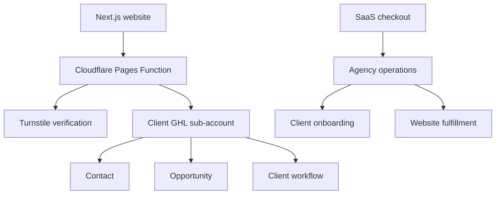

# Plumber Growth System — Data Mapping and Integrations

## Document Control

| Field | Value |
|---|---|
| Project | Plumber Growth System |
| Document | Data Mapping and Integrations |
| Document ID | 11-data-mapping-and-integrations |
| Version | 1.0 |
| Status | Draft for Approval |
| Parent Documents | 00-project-overview.md through 10-ghl-workflow-specifications.md |
| Website | Next.js on Cloudflare Pages |
| CRM | GoHighLevel |
| Public Forms | Native Next.js forms |

---

## 1. Purpose

This document defines how data moves between:

- Next.js
- Cloudflare Pages Functions
- Cloudflare Turnstile
- GoHighLevel
- GHL workflows
- GHL calendars
- GHL web chat
- Website analytics
- The agency operations account
- The client plumbing sub-account

It establishes:

- Data ownership
- Field mapping
- Contact matching
- Opportunity creation
- Workflow-trigger contracts
- Environment variables
- Consent records
- Error handling
- Integration testing
- Security boundaries

---

## 2. Integration Architecture



---

## 3. System Responsibilities

| System                     | Responsibility                                                 |
| -------------------------- | -------------------------------------------------------------- |
| Next.js                    | Public pages, native forms and user experience                 |
| Cloudflare Pages           | Static website hosting                                         |
| Cloudflare Pages Functions | Trusted form processing and GHL delivery                       |
| Cloudflare Turnstile       | Public-form abuse reduction                                    |
| Client GHL sub-account     | Plumbing contacts, opportunities and workflows                 |
| Agency operations account  | SaaS customers, onboarding, fulfillment and billing operations |
| Stripe or GHL payments     | Subscription payment processing                                |
| Analytics platform         | Non-sensitive website and conversion events                    |
| GitHub                     | Website source code and controlled public configuration        |

---

## 4. Data-Ownership Rules

### Client operational data

Belongs to or is controlled for the plumbing client according to the service agreement:

* Plumbing customer contacts
* Service requests
* Customer conversations
* Opportunities
* Appointments
* Estimate data
* Job outcomes
* Customer feedback
* Review-request activity

### Agency operational data

Managed by the agency:

* SaaS subscription status
* Website onboarding status
* Fulfillment tasks
* Snapshot version
* Template version
* Deployment status
* Support activity
* Billing administration
* Client configuration record

### Agency intellectual property

The agency retains rights to:

* Core website template
* Reusable components
* Design system
* Snapshot architecture
* Reusable workflow logic
* Internal implementation procedures
* Generic content structures

Final ownership and portability rules require contractual review.

---

## 5. Integration Boundaries

### Public browser may access

* Public website content
* Public business information
* Public Turnstile site key
* Public web-chat widget identifier
* Public analytics identifier
* Form endpoints
* Public calendar or request-service URL

### Cloudflare Function may access

* Turnstile secret
* Client GHL Location ID
* GHL private integration token
* Pipeline and stage IDs
* Custom field IDs
* Approved tags
* Agency onboarding integration credentials
* Idempotency and rate-limit services
* Server-side logs

### Browser must never access

* GHL private token
* Private webhook URL
* Turnstile secret
* Internal notification credentials
* Secret signing keys
* Agency administrative identifiers
* Stripe secret keys
* Client or agency passwords

---

## 6. Preferred GHL Integration Method

### Pilot recommendation

Use one client-specific GHL private integration token stored in the corresponding Cloudflare Pages project.

Advantages:

* Client isolation
* Least-privilege access
* Easier credential revocation
* Clear connection between website and GHL location
* Reduced cross-client exposure

### Required capabilities

The integration requires only the scopes necessary to:

* Search contacts
* Create contacts
* Update contacts
* Create opportunities
* Update opportunities when needed
* Apply tags
* Read required location configuration when needed

Do not grant broad administrative access when narrower permissions are available.

### Future option

A centralized OAuth integration may be evaluated after the pilot when client volume justifies:

* Authorization management
* Token refresh
* Revocation handling
* Multi-client installation
* Centralized monitoring

---

## 7. Location Isolation

Each client must have:

* One client GHL Location ID
* One client-specific GHL token
* One Cloudflare Pages project
* One production domain
* One client configuration
* One custom-field map
* One pipeline map
* One calendar map
* One review destination

A client website must never use a global token capable of writing to unrelated customer locations unless a future architecture includes equivalent tenant isolation and auditing.

---

## 8. Canonical Application Field Names

Use stable application keys independent of GHL field IDs.

```ts
interface ContactIdentity {
  firstName: string;
  lastName?: string;
  email?: string;
  phone?: string;
}

interface ServiceRequest {
  customerType?: "residential" | "commercial";
  plumbingService?: PlumbingServiceSlug;
  serviceUrgency?: "standard" | "urgent" | "emergency";
  problemDescription?: string;
  serviceAddress?: ServiceAddress;
  existingCustomer?: "yes" | "no" | "unsure";
  preferredDate?: string;
  preferredTime?: string;
  preferredContactMethod?: "phone" | "text" | "email";
}

interface EmergencyDetails {
  emergencyType?: EmergencyType;
  activeFlooding?: TriState;
  waterShutOff?: TriState;
  gasOdor?: TriState;
  electricalDanger?: TriState;
  safetyAcknowledgment?: boolean;
}
```

GHL identifiers must remain mapping configuration—not application field names.

---

## 9. General Quote Field Mapping

| Application field        | GHL destination                  |
| ------------------------ | -------------------------------- |
| `firstName`              | Contact First Name               |
| `lastName`               | Contact Last Name                |
| `email`                  | Contact Email                    |
| `phone`                  | Contact Phone                    |
| `customerType`           | Customer Type                    |
| `plumbingService`        | Plumbing Service Requested       |
| `problemDescription`     | Problem Description              |
| `streetAddress`          | Service Street Address           |
| `addressLine2`           | Service Address Line 2           |
| `city`                   | Service City                     |
| `state`                  | Service State                    |
| `postalCode`             | Service ZIP Code                 |
| `preferredDate`          | Preferred Appointment Date       |
| `preferredTime`          | Preferred Appointment Time       |
| `preferredContactMethod` | Preferred Contact Method         |
| `existingCustomer`       | Existing Customer                |
| `submissionId`           | Submission ID                    |
| `formType`               | Lead Form Type                   |
| Attribution              | Corresponding attribution fields |
| Service consent          | Corresponding consent fields     |

### GHL tags

```text
website-lead
general-quote-request
priority-standard
service-[service-slug]
```

### Opportunity

```text
Pipeline: Plumbing Lead Pipeline
Stage: New Lead
Status: Open
Source: Website — General Quote
```

---

## 10. Emergency Request Field Mapping

| Application field        | GHL destination                  |
| ------------------------ | -------------------------------- |
| Identity fields          | Standard contact fields          |
| Address fields           | Service-address fields           |
| `emergencyType`          | Emergency Type                   |
| `activeFlooding`         | Active Flooding                  |
| `waterShutOff`           | Water Shut Off                   |
| `gasOdor`                | Gas Odor                         |
| `electricalDanger`       | Electrical Danger                |
| `problemDescription`     | Problem Description              |
| `safetyAcknowledgment`   | Safety Acknowledgment            |
| `preferredContactMethod` | Preferred Contact Method         |
| `submissionId`           | Submission ID                    |
| Attribution              | Corresponding attribution fields |
| Service consent          | Corresponding consent fields     |

### Tags

```text
website-lead
emergency-plumbing-request
priority-emergency
emergency-[emergency-type]
```

When applicable:

```text
safety-escalation-indicated
```

### Opportunity

```text
Pipeline: Plumbing Lead Pipeline
Stage: New Lead
Status: Open
Priority: High
Source: Website — Emergency Request
```

---

## 11. Contact Form Field Mapping

| Application field        | GHL destination                  |
| ------------------------ | -------------------------------- |
| Identity fields          | Standard contact fields          |
| `subject`                | Contact Subject                  |
| `message`                | Contact Message or contact note  |
| `preferredContactMethod` | Preferred Contact Method         |
| `submissionId`           | Submission ID                    |
| Attribution              | Corresponding attribution fields |
| Consent                  | Corresponding consent fields     |

### Subject tags

```text
contact-plumbing-service-question
contact-existing-appointment
contact-existing-customer-support
contact-billing-question
contact-financing-question
contact-vendor-inquiry
contact-employment-inquiry
contact-general-question
contact-other
```

### Opportunity behavior

Create an opportunity only for:

* Plumbing service question
* Financing question connected to potential plumbing work

---

## 12. Review Feedback Mapping

| Application field        | GHL destination                      |
| ------------------------ | ------------------------------------ |
| Identity fields          | Standard contact fields              |
| `serviceDate`            | Service Date                         |
| `technicianName`         | Technician Name                      |
| `rating`                 | Private Feedback Rating              |
| `feedback`               | Private Feedback                     |
| `permissionToContact`    | Permission to Contact About Feedback |
| `testimonialPermission`  | Testimonial Permission               |
| `testimonialAttribution` | Testimonial Attribution              |
| `submittedAt`            | Feedback Submitted Date              |
| `submissionId`           | Submission ID                        |

### Tags

```text
customer-feedback-submitted
private-rating-[rating]
```

When applicable:

```text
feedback-recovery-required
testimonial-consent-yes
```

### Opportunity behavior

Do not create a plumbing sales opportunity.

A low rating creates an internal recovery task through the appropriate workflow.

---

## 13. Website Onboarding Mapping

Website onboarding data belongs in the agency operations environment, not the plumber’s customer pipeline.

### Agency record mapping

| Application data       | Agency destination        |
| ---------------------- | ------------------------- |
| Business name          | SaaS customer record      |
| Primary contact        | Client contact            |
| Subscription reference | Subscription field        |
| Onboarding status      | SaaS Onboarding Status    |
| Submission date        | Onboarding Submitted Date |
| Authorized approver    | Authorized Approver       |
| Website status         | Website Production Status |
| Production URL         | Production Website URL    |
| Snapshot version       | Snapshot Version          |
| Template version       | Template Version          |

### Detailed onboarding payload

The complete onboarding submission should not be flattened into dozens of ordinary contact fields without operational need.

Approved options include:

* Restricted agency custom object
* Secure structured record
* Restricted document
* Approved external operations database

The final storage method remains an open decision.

### Trigger tag

```text
onboarding-submitted
```

### Fulfillment stage

```text
Assets Received
```

---

## 14. Contact Matching and Deduplication

Contact matching must avoid creating unnecessary duplicates without silently merging different people.

### Matching order

1. Exact normalized phone match
2. Exact normalized email match
3. Both phone and email match
4. No confident match: create a new contact

### Conflict rules

If:

* Phone matches one contact, and
* Email matches a different contact

then:

* Do not merge automatically
* Log a contact-match conflict
* Create an agency review task
* Use the safest non-destructive behavior

### Update rules

When a confident contact match exists:

* Update blank fields
* Update explicitly current service-request fields
* Preserve original attribution separately
* Update most-recent attribution separately
* Do not overwrite verified customer information with empty values
* Do not overwrite consent with a less-permissive assumption
* Record new consent evidence independently

### Shared household warning

Phone numbers and email addresses may occasionally be shared.

Do not assume every match represents permanent identity certainty.

---

## 15. Attribution Mapping

### Original attribution

Populate only when the contact has no recorded original attribution.

Fields:

* Original Landing Page
* Original Referrer
* Original UTM Source
* Original UTM Medium
* Original UTM Campaign
* Original UTM Term
* Original UTM Content
* Original Click Identifier
* Original Submission Date

### Most-recent attribution

Update with each valid new submission:

* Most Recent Landing Page
* Most Recent Referrer
* Most Recent UTM values
* Most Recent Click Identifier
* Most Recent Submission Date
* Most Recent Form Submitted

### Opportunity attribution

Each opportunity should store the source associated with that specific service request.

Do not overwrite original contact attribution every time the person returns.

---

## 16. Opportunity Creation Rules

### Create a new opportunity when

* A new general quote request represents a new plumbing need
* A new emergency request is submitted
* A Contact Form submission is a qualified service inquiry
* No equivalent open opportunity exists

### Reuse or update an open opportunity when

All of the following substantially match:

* Same contact
* Same service category
* Same service address
* Existing opportunity remains open
* Submission occurs within the configured duplicate window
* The new submission appears to add information to the same job

### Recommended duplicate window

```text
30 days
```

Emergency requests may require a shorter window or a new opportunity when the Submission ID indicates a distinct incident.

### Do not create an opportunity for

* General administrative contact
* Existing appointment question
* Billing question
* Vendor inquiry
* Employment inquiry
* Private review feedback
* SaaS onboarding

---

## 17. Opportunity Name Format

### General quote

```text
[Service Name] — [Contact Name]
```

Example:

```text
Drain Cleaning — Maria Johnson
```

### Emergency request

```text
URGENT — [Emergency Type] — [Contact Name]
```

Example:

```text
URGENT — Burst Pipe — David Lee
```

### Contact service inquiry

```text
Service Question — [Contact Name]
```

Do not include full street addresses or sensitive details in opportunity names.

---

## 18. Opportunity Notes

Add a structured note containing:

* Form type
* Submission ID
* Service
* Urgency
* Address summary
* Problem description
* Preferred contact
* Preferred date
* Attribution summary
* Submission timestamp

The note should be readable by office staff.

Do not include:

* Turnstile token
* Integration details
* Consent internals not needed operationally
* Hidden anti-spam data
* Full diagnostic logs

---

## 19. Workflow-Trigger Contract

The integration must apply workflow-trigger tags only after required GHL operations succeed.

### General quote sequence

1. Upsert contact.
2. Update fields.
3. Create or identify opportunity.
4. Add opportunity note.
5. Apply service and priority tags.
6. Apply `general-quote-request` last.
7. Return accepted response.

### Emergency sequence

1. Upsert contact.
2. Update emergency fields.
3. Create or identify urgent opportunity.
4. Add emergency note.
5. Apply emergency and priority tags.
6. Apply `emergency-plumbing-request` last.
7. Return accepted response.

### Why trigger tags are applied last

This prevents a workflow from starting before the required contact and opportunity records are ready.

---

## 20. Idempotency Contract

Each browser submission must include an idempotency key.

The Cloudflare Function must:

1. Validate the key format.
2. Check whether it was processed recently.
3. Return the prior accepted result when safe.
4. Avoid creating duplicate opportunities.
5. Avoid applying the trigger tag twice.
6. Record processing status.

### Suggested statuses

```text
received
processing
accepted
partial-failure
failed
```

### Retention

The final idempotency storage and retention period must be defined during implementation.

---

## 21. Partial-Failure Handling

### Contact succeeds, opportunity fails

* Record partial failure
* Do not apply the lead-intake trigger tag
* Retry opportunity creation when safe
* Notify the agency after the retry threshold
* Return a controlled failure unless reliable recovery is guaranteed

### Contact and opportunity succeed, tag fails

* Record partial failure
* Retry tag application
* Avoid creating another opportunity
* Notify the agency if workflow entry cannot be established

### Customer acknowledgment fails

* Preserve the accepted contact and opportunity
* Record communication failure
* Notify the company through another available internal channel
* Do not duplicate the lead record

---

## 22. Custom Field Mapping Configuration

Use a server-only configuration object.

```ts
interface GhlFieldMap {
  plumbingService: string;
  serviceUrgency: string;
  customerType: string;
  problemDescription: string;
  serviceStreetAddress: string;
  serviceAddressLine2: string;
  serviceCity: string;
  serviceState: string;
  servicePostalCode: string;
  existingCustomer: string;
  preferredDate: string;
  preferredTime: string;
  preferredContactMethod: string;
  emergencyType: string;
  activeFlooding: string;
  waterShutOff: string;
  gasOdor: string;
  electricalDanger: string;
  safetyAcknowledgment: string;
  submissionId: string;
  leadFormType: string;
  privateFeedbackRating: string;
  privateFeedback: string;
  testimonialPermission: string;
}
```

Validate the map at server startup or on the first controlled request.

If a required field ID is missing:

* Stop processing
* Return a controlled failure
* Notify the agency
* Do not send incomplete customer data into the wrong fields

---

## 23. Pipeline Configuration

Server-only pipeline configuration:

```ts
interface GhlPipelineConfig {
  pipelineId: string;
  stages: {
    newLead: string;
    contactAttempted: string;
    connected: string;
    estimateRequested: string;
    estimateScheduled: string;
    estimateSent: string;
    jobWon: string;
    jobLost: string;
    followUpNeeded: string;
  };
}
```

Pipeline and stage IDs are client-specific and must not be hard-coded into reusable frontend components.

---

## 24. Tag Configuration

Maintain a controlled allowlist.

```ts
interface GhlTagConfig {
  websiteLead: string;
  generalQuoteRequest: string;
  emergencyRequest: string;
  standardPriority: string;
  emergencyPriority: string;
  customerFeedback: string;
  serviceTags: Record<PlumbingServiceSlug, string>;
  contactSubjectTags: Record<ContactSubject, string>;
}
```

The server must not accept a tag name directly from browser input.

---

## 25. Cloudflare Environment Variables

### Public

```text
NEXT_PUBLIC_SITE_URL
NEXT_PUBLIC_TURNSTILE_SITE_KEY
NEXT_PUBLIC_ANALYTICS_ID
NEXT_PUBLIC_GHL_CHAT_WIDGET_ID
```

Only expose variables required by browser functionality.

### Client GHL integration

```text
GHL_LOCATION_ID
GHL_PRIVATE_INTEGRATION_TOKEN
GHL_PIPELINE_ID
GHL_STAGE_NEW_LEAD_ID
GHL_STAGE_CONTACT_ATTEMPTED_ID
GHL_STAGE_CONNECTED_ID
GHL_STAGE_ESTIMATE_REQUESTED_ID
GHL_STAGE_ESTIMATE_SCHEDULED_ID
GHL_STAGE_ESTIMATE_SENT_ID
GHL_STAGE_JOB_WON_ID
GHL_STAGE_JOB_LOST_ID
GHL_STAGE_FOLLOW_UP_NEEDED_ID
GHL_CUSTOM_FIELD_MAP
GHL_TAG_MAP
GHL_CALENDAR_ID
```

### Form security

```text
TURNSTILE_SECRET_KEY
FORM_SIGNING_SECRET
IDEMPOTENCY_NAMESPACE
RATE_LIMIT_NAMESPACE
```

### Agency onboarding

```text
AGENCY_GHL_LOCATION_ID
AGENCY_GHL_PRIVATE_INTEGRATION_TOKEN
AGENCY_ONBOARDING_FIELD_MAP
AGENCY_FULFILLMENT_PIPELINE_ID
AGENCY_STAGE_ASSETS_RECEIVED_ID
```

Agency credentials must be isolated from client operational credentials.

---

## 26. Environment Validation

Production deployment must fail or remain unhealthy when required variables are missing.

Validate:

* URL formats
* Token presence
* Location ID format
* Pipeline ID presence
* Stage ID completeness
* Field-map JSON
* Tag-map JSON
* Turnstile keys
* Site URL consistency

Never substitute production credentials with demonstration defaults.

---

## 27. GHL Web Chat Integration

### Purpose

Allow website visitors to begin a GHL conversation.

### Browser exposure

The public widget identifier or approved embed configuration may appear in the website.

### Client-specific configuration

Each client requires:

* Client-specific chat widget
* Correct GHL location
* Correct business identity
* Correct availability
* Appropriate consent language
* Correct routing
* Tested mobile behavior

### Performance rules

* Load the chat script after critical page content
* Avoid blocking initial rendering
* Test Core Web Vitals impact
* Prevent duplicate script injection
* Disable on Client Onboarding where inappropriate
* Ensure the widget does not cover the mobile conversion bar

---

## 28. Calendar Integration

### Supported approaches

* Link to GHL calendar
* Embed approved calendar
* Use appointment-request workflow
* Route service requests to staff confirmation

### Initial recommendation

Use an appointment-request model unless the plumber’s availability is sufficiently reliable for direct confirmation.

### Data requirements

Pass only safe context such as:

* Contact identity
* Service requested
* Preferred date
* Source

Do not expose private contact data in query strings.

---

## 29. Call Tracking Integration

The public website may display the GHL-assigned business or tracking number.

Requirements:

* Number must be client-specific
* Number must route correctly
* Click-to-call must use the same verified number
* Structured data must use the approved public business number
* Tracking must not create inconsistent business identity
* Call recording requires applicable notice and legal review
* Missed-call workflow must be tested before launch

---

## 30. Review Integration

### Public review destination

Use the verified client-specific Google review URL.

### Private feedback destination

Use:

```text
/review-feedback/
```

### Requirements

* The public review link remains available regardless of private rating
* GHL workflow messages use the verified public-review URL
* Private feedback triggers internal recovery when appropriate
* No review destination remains set to a placeholder

---

## 31. Consent Data Mapping

Store service and marketing consent separately.

### Service-related SMS consent record

```ts
interface ConsentRecord {
  consentType: "service-sms" | "marketing-sms" | "marketing-email";
  granted: boolean;
  textVersion: string;
  collectedAt: string;
  sourceForm: string;
  pageUrl: string;
  submissionId: string;
}
```

### Rules

* Do not infer marketing consent from a service request
* Do not overwrite opt-out status
* Do not re-enable DND from a new form without an approved legal and platform-compliant process
* Preserve the consent text version
* Record the form and page where consent was collected

Final consent implementation requires legal review.

---

## 32. Analytics Integration

### Browser events

Track:

* `phone_click`
* `request_service_view`
* `general_quote_submit`
* `emergency_request_view`
* `emergency_request_submit`
* `contact_submit`
* `appointment_request`
* `chat_open`
* `review_link_click`
* `review_feedback_submit`

### Server acceptance rule

Form-success events must fire only after the server confirms acceptance.

### Prohibited analytics data

Do not send:

* Name
* Email
* Phone
* Street address
* Customer message
* Emergency safety answers
* Private rating
* Review feedback
* Onboarding details
* GHL contact ID
* Private opportunity ID

Use controlled categorical values only.

---

## 33. Error Mapping

| Internal condition            | Public code                |
| ----------------------------- | -------------------------- |
| Invalid request               | `FORM_VALIDATION_FAILED`   |
| Turnstile rejection           | `FORM_VERIFICATION_FAILED` |
| Rate limit                    | `FORM_RATE_LIMITED`        |
| Duplicate accepted submission | `FORM_ALREADY_ACCEPTED`    |
| Missing server configuration  | `FORM_CONFIGURATION_ERROR` |
| GHL authentication failure    | `FORM_DELIVERY_FAILED`     |
| GHL unavailable               | `FORM_DELIVERY_FAILED`     |
| Opportunity failure           | `FORM_DELIVERY_FAILED`     |
| Unexpected error              | `FORM_UNEXPECTED_ERROR`    |

Public responses must not identify GHL as the failed system.

---

## 34. Integration Logging

### Log

* Environment
* Client configuration identifier
* Submission ID
* Form type
* Processing stage
* GHL operation category
* HTTP result category
* Opportunity result
* Trigger-tag result
* Duration
* Retry count
* Stable error code

### Do not log

* Full name
* Full phone
* Full email
* Full address
* Full problem description
* Private feedback
* Onboarding responses
* Tokens
* Webhook URLs
* Consent wording
* Payment information

---

## 35. Integration Test Matrix

### General Quote

Verify:

* Contact created
* Existing contact updated
* Original attribution preserved
* Most-recent attribution updated
* Opportunity created
* Duplicate opportunity prevented
* Service tag applied
* Trigger tag applied last
* Workflow starts once
* Success event fires once

### Emergency Request

Verify:

* Emergency fields mapped
* High-priority opportunity created
* Emergency tag applied
* Safety tag applied when appropriate
* Internal notification begins
* One acknowledgment sent
* No dispatch confirmation
* No general nurture enrollment

### Contact

Verify:

* Subject mapped
* Service inquiry creates opportunity
* Billing question does not create opportunity
* Existing appointment does not create opportunity
* Correct internal route occurs

### Review Feedback

Verify:

* Rating stored privately
* Low rating creates recovery task
* No sales opportunity created
* Testimonial consent stored separately
* Public review option remains available
* Rating excluded from analytics

### Website Onboarding

Verify:

* Secure access required
* Agency record updated
* Client plumbing account unaffected
* Fulfillment stage updated
* Implementation notification sent
* No ordinary lead opportunity created

---

## 36. End-to-End Provisioning Test

For every new client:

1. Provision the GHL sub-account.
2. Apply the snapshot.
3. Populate custom values.
4. Connect communication services.
5. Create the client-specific integration token.
6. Record location, field, pipeline and stage IDs.
7. Configure Cloudflare environment variables.
8. Deploy the preview website.
9. Submit each form with test data.
10. Verify contact records.
11. Verify opportunity behavior.
12. Verify workflows.
13. Verify messages.
14. Verify internal notifications.
15. Verify analytics exclusions.
16. Clear test contacts and opportunities where appropriate.
17. Approve production deployment.

---

## 37. Integration Monitoring

Monitor:

* Form acceptance rate
* Form error rate
* Turnstile failure rate
* GHL authentication failures
* Contact creation failures
* Opportunity creation failures
* Trigger-tag failures
* Workflow-entry failures
* Message delivery failures
* Duplicate submissions
* Processing latency

### Alert priorities

#### Critical

* All forms failing
* GHL authentication failure
* Emergency requests failing
* Cross-client routing
* Secret exposure

#### High

* Opportunity creation failing
* Trigger tags failing
* Internal emergency notification failing
* Missed-call workflow failing

#### Normal

* Individual invalid contact
* Individual delivery failure
* Duplicate form attempt
* User validation error

---

## 38. Credential Rotation

Rotate credentials when:

* A token may have been exposed
* An agency employee loses access
* A client terminates service
* Integration permissions change
* Platform security policy requires it
* A repository or environment is compromised

After rotation:

1. Update Cloudflare secrets.
2. Redeploy if required.
3. Test every form.
4. Confirm old credentials no longer work.
5. Record the rotation date without recording the secret.

---

## 39. Cancellation Integration Tasks

At cancellation:

* Stop new website form processing at the appropriate effective time
* Revoke client-specific GHL integration token
* Remove Cloudflare secrets
* Determine website status
* Determine domain status
* Determine phone-number status
* Export eligible client data
* Preserve required billing records
* Archive the integration map securely
* Do not delete customer data automatically

Final actions depend on the approved cancellation and retention policy.

---

## 40. Data Mapping Acceptance Criteria

The integration architecture is accepted when:

1. Each application field has a defined destination.
2. GHL field IDs remain server-side.
3. Each client has isolated credentials.
4. Contact matching avoids uncontrolled merges.
5. Original attribution is preserved.
6. Recent attribution is updated separately.
7. Duplicate opportunities are controlled.
8. Workflow tags are applied only after required records exist.
9. Emergency requests create high-priority opportunities.
10. Contact subjects create opportunities only when appropriate.
11. Review feedback does not create sales opportunities.
12. Onboarding writes to the agency operations environment.
13. Consent types remain separate.
14. Form-success analytics fire only after acceptance.
15. Personal information is excluded from analytics.
16. Partial failures have defined recovery behavior.
17. Required environment variables are validated.
18. All five forms pass end-to-end integration tests.
19. Cross-client data routing is prevented.
20. Credential rotation and cancellation procedures exist.

---

## 41. Open Decisions

The following remain unresolved:

* Final GHL authentication method after the pilot
* Exact API version and endpoints
* Exact private integration scopes
* Final custom-field IDs
* Final opportunity deduplication window
* Idempotency storage technology
* Rate-limiting storage technology
* Detailed onboarding storage
* Final analytics platform
* Error-monitoring platform
* Calendar link versus embedded calendar
* Whether GHL contact IDs may be used in restricted server logs
* Future OAuth architecture
* Final data-export format
* Final retention periods
* Final cancellation website behavior

---

## 42. Next Document

The next project document is:

`12-client-onboarding-and-fulfillment.md`

It will define:

* Purchase-to-launch workflow
* Client responsibilities
* Agency responsibilities
* Onboarding questionnaire
* Asset collection
* Access requests
* Content verification
* Website customization
* GHL configuration
* QA
* Revisions
* Approval
* Launch
* Handoff
* Ongoing support
