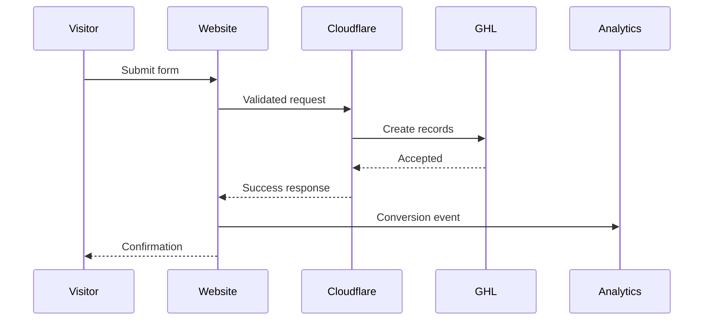

# Plumber Growth System — Analytics and Conversion Tracking

## Document Control

| Field | Value |
|---|---|
| Project | Plumber Growth System |
| Document | Analytics and Conversion Tracking |
| Document ID | 13-analytics-and-conversion-tracking |
| Version | 1.0 |
| Status | Draft for Approval |
| Parent Documents | 00-project-overview.md through 12-client-onboarding-and-fulfillment.md |
| Website Platform | Next.js on Cloudflare Pages |
| CRM | GoHighLevel |
| Primary Objective | Measure qualified plumbing opportunities without exposing customer data |

---

## 1. Purpose

This document defines how the Plumber Growth System will measure website visibility, visitor actions, calls, conversations, service requests, opportunities, appointments, reviews, and customer outcomes.

It establishes:

- Measurement principles
- Analytics platforms
- Conversion definitions
- Event names
- Event properties
- Form tracking
- Call tracking
- Chat tracking
- GHL attribution
- Search performance
- Reporting
- Privacy
- Consent
- Data quality
- Testing
- Key performance indicators

---

## 2. Measurement Objectives

The analytics system must answer:

1. How are people discovering the plumbing company?
2. Which pages attract qualified visitors?
3. Which services generate inquiries?
4. Which service areas generate inquiries?
5. How many visitors call, chat, or submit forms?
6. Which submissions become qualified opportunities?
7. Which opportunities become estimates?
8. Which opportunities become won jobs?
9. Which sources produce valuable customers?
10. Where are visitors abandoning the conversion process?
11. Are forms and integrations working?
12. Is the customer using the operational system?
13. Is the product delivering visible activity?
14. Are acquisition and fulfillment economics sustainable?

---

## 3. Measurement Principles

### 3.1 Measure outcomes, not only traffic

Website sessions do not equal plumbing opportunities.

Reporting should distinguish:

- Page view
- Conversion action
- Accepted form submission
- Qualified lead
- Opportunity
- Estimate
- Appointment
- Won job
- Revenue where accurately recorded

### 3.2 Protect personal information

Do not send customer names, phone numbers, emails, street addresses, messages, or emergency details to general analytics platforms.

### 3.3 Preserve attribution honestly

When a source is unknown, record it as unknown or direct. Do not assign credit without evidence.

### 3.4 Separate marketing and operations

Website analytics measure visitor behavior. GHL measures operational lead and opportunity activity.

Neither system alone provides the complete customer journey.

### 3.5 Track accepted submissions

A form-success conversion must fire only after the Cloudflare processing layer accepts the submission.

### 3.6 Avoid inflated conversions

Repeated clicks, duplicate submissions, spam, internal tests, and invalid leads must not be reported as equivalent to qualified opportunities.

---

## 4. Recommended Measurement Stack

### Required

- Google Analytics 4 or approved equivalent
- Google Search Console
- Bing Webmaster Tools
- GoHighLevel reporting
- GHL call tracking
- Cloudflare operational logs
- Cloudflare Web Analytics, optional
- GHL opportunity source and attribution fields

### Conditional

- Google Ads conversion tracking
- Microsoft Advertising conversion tracking
- Local Services Ads reporting
- CallRail or another external call-tracking platform
- Apple Business Connect
- Error-monitoring platform
- Privacy-consent platform
- Dashboarding platform

Advertising integrations are outside the initial base service unless separately approved.

---

## 5. Analytics Account Ownership

Preferred ownership model:

- Client owns or receives administrative access to its analytics properties.
- Agency receives the access required to configure and maintain them.
- The agency does not create permanent dependence on a personal employee account.
- Access is granted through secure invitations.
- Shared passwords are prohibited.

Maintain an access register for:

- Google Analytics
- Google Search Console
- Bing Webmaster Tools
- Google Business Profile
- Apple Business Connect
- Advertising platforms
- Call-tracking platforms

---

## 6. Environment Separation

### Local development

- Analytics disabled or sent to a test property
- No production conversion events
- No production GHL records by default

### Preview

- Marked `noindex`
- Uses test analytics or debug mode
- Uses a designated test GHL sub-account
- Excluded from production reporting

### Production

- Uses the client’s production analytics property
- Uses the production GHL sub-account
- Uses verified production domains
- Sends approved conversion events

Preview and local traffic must not contaminate production reporting.

---

## 7. Event Naming Standards

Use:

- Lowercase
- Snake case
- Stable names
- Action-oriented language
- No client-specific names in event names
- No personal data

Examples:

```text
phone_click
request_service_view
general_quote_start
general_quote_submit
emergency_request_view
emergency_request_start
emergency_request_submit
contact_form_start
contact_submit
appointment_request
chat_open
chat_message_started
review_link_click
review_feedback_submit
```

Do not rename established events without documenting the migration.

---

## 8. Event Classification

### Engagement events

* Service page view
* Location page view
* FAQ interaction
* Review section view
* Financing page view
* Chat open

### Micro-conversions

* Phone click
* Form start
* Calendar open
* Review-link click
* Chat conversation started

### Primary website conversions

* Accepted General Quote submission
* Accepted Emergency Request submission
* Accepted service-oriented Contact submission
* Appointment request
* Qualified inbound call
* Qualified chat inquiry

### Operational conversions

* Qualified opportunity
* Connected lead
* Estimate requested
* Estimate scheduled
* Estimate sent
* Job won
* Job lost

### Reputation conversions

* Review request sent
* Public-review link clicked
* New review detected
* Private feedback submitted
* Recovery task created

---

## 9. Event Data Contract

Each approved event may include controlled properties.

```ts
interface AnalyticsEvent {
  eventName: string;
  pagePath: string;
  pageType?: string;
  serviceSlug?: string;
  locationSlug?: string;
  formType?: string;
  contactMethod?: string;
  customerType?: string;
  emergencyType?: string;
  campaignSource?: string;
  campaignMedium?: string;
  campaignName?: string;
  successCategory?: string;
}
```

### Prohibited properties

Never send:

* First or last name
* Email
* Phone
* Street address
* Full ZIP code when it creates privacy risk
* Customer message
* Problem description
* Gas-odor answer
* Flooding answer
* Electrical-danger answer
* Private rating
* Review feedback
* Testimonial
* GHL contact ID
* GHL opportunity ID
* Onboarding responses
* Payment information

---

## 10. Page Classification

Every tracked page should have a controlled page type.

```text
home
services_hub
service
residential_hub
commercial_hub
service_areas_hub
location
about
reviews
financing
faq
contact
request_service
emergency_request
review_feedback
client_onboarding
legal
thank_you
```

Client Onboarding activity must not be sent to public marketing analytics beyond strictly necessary operational completion status.

---

## 11. Standard Website Events

| Event                      | Trigger                                 | Conversion level    |
| -------------------------- | --------------------------------------- | ------------------- |
| `phone_click`              | User activates a telephone link         | Micro               |
| `request_service_view`     | Request Service page viewed             | Engagement          |
| `general_quote_start`      | User begins meaningful form interaction | Micro               |
| `general_quote_submit`     | Server accepts General Quote submission | Primary             |
| `emergency_request_view`   | Emergency Request page viewed           | Engagement          |
| `emergency_request_start`  | User begins emergency form              | Micro               |
| `emergency_request_submit` | Server accepts emergency form           | Primary             |
| `contact_form_start`       | User begins Contact Form                | Micro               |
| `contact_submit`           | Server accepts Contact Form             | Conditional primary |
| `appointment_request`      | Appointment request accepted            | Primary             |
| `chat_open`                | GHL chat opened                         | Engagement          |
| `chat_message_started`     | Visitor sends first chat message        | Micro or primary    |
| `review_link_click`        | Public-review link activated            | Reputation          |
| `review_feedback_submit`   | Private feedback accepted               | Reputation          |
| `faq_expand`               | FAQ disclosure opened                   | Engagement          |

Avoid tracking every minor interaction when it does not inform a decision.

---

## 12. Form View and Start Definitions

### Form view

Record when:

* The form page loads, or
* An embedded form section becomes meaningfully visible

### Form start

Record only after meaningful interaction, such as:

* First valid field interaction
* First field completion
* First selection

Do not treat accidental focus as a meaningful start when avoidable.

### Form submission

Record only after:

* Server validation passes
* Turnstile passes
* Required GHL records are accepted
* The server returns an accepted response

---

## 13. General Quote Tracking

### Funnel

```text
Request Service View
→ General Quote Start
→ General Quote Submit
→ GHL Opportunity Created
→ Lead Connected
→ Estimate Requested
→ Estimate Sent
→ Job Won or Lost
```

### Allowed event properties

* Service slug
* Residential or commercial
* Page path
* Landing-page category
* UTM source
* UTM medium
* UTM campaign
* Success category

Do not send the service address or problem description.

---

## 14. Emergency Request Tracking

### Funnel

```text
Emergency Page View
→ Emergency Form Start
→ Emergency Request Submit
→ High-Priority Opportunity
→ Human Contact
→ Service Outcome
```

### Allowed properties

* Controlled emergency-type category
* Page path
* UTM source
* UTM medium
* UTM campaign
* Success category

### Prohibited properties

Do not send to public analytics:

* Gas odor
* Electrical danger
* Active flooding
* Water shutoff
* Address
* Problem description

Emergency form activity should be used for operational reliability, not sensational marketing reporting.

---

## 15. Contact Form Tracking

Record:

```text
contact_form_start
contact_submit
```

Allowed property:

```text
subject_category
```

Classify accepted contacts as:

* Service inquiry
* Existing customer
* Billing
* Financing
* Vendor
* Employment
* General

Only a qualifying service or financing inquiry should count as a primary marketing conversion.

---

## 16. Review Tracking

Track:

* Review Feedback page view
* Private feedback accepted
* Public-review link click
* GHL review request sent
* GHL review reminder sent
* New review detected where supported

Do not track private rating or feedback in general analytics.

Private rating belongs in restricted operational reporting.

A review-link click does not prove that a public review was completed.

---

## 17. Client Onboarding Tracking

Client Onboarding should use restricted operational tracking.

Allowed operational events:

```text
onboarding_link_opened
onboarding_started
onboarding_completed
onboarding_expired
```

Allowed properties:

* Internal client reference
* Completion status
* Timestamp
* Missing-section count

Do not send onboarding content into GA4 or other public marketing analytics.

---

## 18. Phone Tracking

### Click-to-call

`phone_click` means the visitor activated a phone link.

It does not prove:

* The call connected
* The call was answered
* The caller was qualified
* A job was booked

### GHL call tracking

GHL should track, where configured:

* Inbound call
* Answered call
* Missed call
* Call duration
* Caller contact
* Source where available
* Opportunity association
* Missed-call text response
* Callback

### Qualified-call definition

A qualified call should meet an approved rule such as:

* Confirmed plumbing-service intent
* Minimum meaningful duration
* Manually qualified outcome
* Opportunity creation

Do not classify every call as a lead automatically.

### Call recording

Call recording or transcription requires:

* Applicable notice
* Jurisdictional review
* Data-retention rules
* Access controls
* Client approval

---

## 19. Chat Tracking

Track, where technically supported:

* Chat opened
* First message sent
* Contact information provided
* Conversation created
* Qualified service inquiry
* Opportunity created

### Chat conversions

A chat open is engagement.

A chat should count as a primary conversion only when:

* A visitor sends a meaningful message, or
* A valid contact or opportunity is created

Do not count repeated widget opens as separate qualified leads.

---

## 20. Calendar Tracking

Distinguish:

* Calendar viewed
* Appointment request started
* Appointment request submitted
* Appointment confirmed
* Appointment rescheduled
* Appointment canceled
* Appointment completed

A preferred date selected on a website form is not a confirmed appointment.

### Event names

```text
calendar_view
appointment_request
appointment_confirmed
appointment_rescheduled
appointment_canceled
appointment_completed
```

Operational appointment events should remain primarily in GHL.

---

## 21. GHL Opportunity Attribution

Each opportunity should preserve:

* Form type
* Lead source
* Landing page
* Original referrer
* UTM source
* UTM medium
* UTM campaign
* UTM term
* UTM content
* Click identifiers where available
* Submission date
* Submission ID
* Service requested
* Service area
* First known source
* Most-recent source

### Attribution hierarchy

Where available:

1. Verified advertising click identifier
2. Verified UTM campaign
3. Referring domain
4. Organic search
5. Google Business Profile
6. Direct
7. Unknown

Do not infer a precise source when evidence is incomplete.

---

## 22. Original and Most-Recent Attribution

### Original attribution

Describes how the contact first entered the tracked system.

It should not be overwritten by later visits.

### Most-recent attribution

Describes the most recent known source associated with a new form submission or opportunity.

### Opportunity attribution

Describes the source of the specific potential job.

A returning customer may have:

* Original contact source: Organic Search
* Most-recent source: Email
* Current opportunity source: Direct Website Request

All three can be valid.

---

## 23. GHL Pipeline Events

Track the time an opportunity enters:

* New Lead
* Contact Attempted
* Connected
* Estimate Requested
* Estimate Scheduled
* Estimate Sent
* Job Won
* Job Lost
* Follow-Up Needed

### Derived metrics

* Lead response time
* Contact rate
* Estimate-request rate
* Estimate-scheduled rate
* Estimate-to-win rate
* Average sales-cycle length
* Won opportunities by source
* Lost reasons by source
* Open-opportunity aging

Pipeline accuracy depends on client use. Reporting must identify when stage data is incomplete.

---

## 24. Revenue Tracking

Revenue should be reported only when:

* The client records accurate job value
* The opportunity is marked won
* The value represents actual or approved revenue
* Duplicate opportunities are controlled

Distinguish:

* Estimated opportunity value
* Estimate amount
* Contracted job value
* Collected revenue
* Subscription revenue

Do not present estimate value as collected revenue.

---

## 25. Search Console Configuration

Each production website should use a verified property.

Preferred:

* Domain property when access permits

Track:

* Search queries
* Landing pages
* Countries
* Devices
* Search appearance
* Indexing
* Sitemaps
* Core Web Vitals
* Enhancements
* Manual actions
* Security issues

### Search Console conversions

Search Console does not replace website analytics or GHL opportunity data.

Use it primarily for search visibility and technical search diagnostics.

---

## 26. Bing Webmaster Tools

Configure:

* Verified domain
* XML sitemap
* Crawl monitoring
* Search query monitoring
* Indexing review
* Site diagnostics

Evaluate IndexNow during implementation.

Do not add an indexing protocol merely because it exists; confirm compatibility, security, and operational value.

---

## 27. Google Business Profile Measurement

Where available and appropriate, monitor:

* Website interactions
* Calls
* Direction requests
* Search visibility
* Review activity
* Profile completeness
* Appointment or service links

GBP reporting should remain separate from website analytics when exact attribution is unavailable.

Do not claim every direct website lead originated from GBP.

---

## 28. Apple Business Connect

Where included, verify:

* Business identity
* Website URL
* Phone
* Address or service-area eligibility
* Hours
* Branding
* Relevant action links

Apple Business Connect activity should be incorporated only when reliable reporting is available.

This configuration may be outside the initial base plan unless explicitly included.

---

## 29. UTM Standards

Use consistent lowercase values.

### Recommended parameters

```text
utm_source
utm_medium
utm_campaign
utm_term
utm_content
```

### Example

```text
?utm_source=google
&utm_medium=paid_search
&utm_campaign=water_heater_primary_market
&utm_content=emergency_ad
```

### Naming requirements

* Lowercase
* Underscores or hyphens used consistently
* No personal data
* No employee names unless operationally necessary
* No spaces
* Documented campaign naming
* Stable source and medium taxonomy

---

## 30. Recommended Source Taxonomy

### Sources

```text
google
bing
facebook
instagram
youtube
google_business_profile
email
sms
referral
direct
unknown
```

### Mediums

```text
organic_search
paid_search
paid_social
organic_social
email
sms
referral
profile
direct
unknown
```

Avoid inventing new labels for the same channel.

---

## 31. Internal Traffic Exclusion

Exclude or identify:

* Agency staff
* Client staff
* Developers
* Automated tests
* Uptime monitors
* Preview deployments
* QA form submissions

Potential methods:

* Test property
* Debug mode
* Controlled test identifiers
* Internal traffic rules
* Test-contact tags
* Known test submission IDs

Do not rely only on IP-address exclusions because staff may work remotely or use changing networks.

---

## 32. Bot and Spam Handling

Do not count rejected form submissions as conversions.

Classify:

* Turnstile rejection
* Honeypot detection
* Rate-limited request
* Invalid form
* Duplicate request
* GHL-rejected delivery
* Manually identified spam lead

Keep spam reporting separate from qualified lead reporting.

---

## 33. Consent and Privacy

Analytics configuration must account for:

* Applicable privacy law
* Client location
* Visitor location
* Cookies
* Advertising features
* Cross-platform sharing
* Data retention
* User deletion requests
* Consent withdrawal

### Consent categories

Potential categories:

* Essential
* Analytics
* Advertising
* Functionality

The final consent implementation requires legal review.

### Default principle

Do not deploy advertising cookies or enhanced advertising features without the appropriate consent and disclosure architecture.

---

## 34. Data Minimization

Collect the minimum analytics data required to answer defined business questions.

Do not collect data merely because a platform permits it.

Review:

* Event necessity
* Property necessity
* Retention
* User-level identifiers
* Advertising features
* Cross-device tracking
* Session recording
* Heatmaps

Session-replay tools require separate privacy and security review and are not included by default.

---

## 35. Data Retention

Define separate retention policies for:

* Website analytics
* GHL contacts
* GHL conversations
* Call recordings
* Call transcripts
* Form-processing logs
* Error logs
* Onboarding data
* Billing records
* Consent records

The final periods require legal, operational and contractual approval.

Do not retain detailed form payloads in diagnostic logs by default.

---

## 36. Reporting Layers

### Client operational dashboard

Focus on:

* New leads
* Missed calls
* Conversations
* Open opportunities
* Estimates
* Appointments
* Won opportunities
* Reviews

### Website performance report

Focus on:

* Organic visibility
* Landing pages
* Calls
* Form submissions
* Chat inquiries
* Conversion rate
* Technical issues

### Agency product dashboard

Focus on:

* Active subscriptions
* New customers
* Onboarding completion
* Time to launch
* Support load
* Form reliability
* Account activation
* Usage costs
* Gross margin
* Churn

---

## 37. Recommended Client Report

A concise monthly report should include:

### Visibility

* Organic impressions
* Organic clicks
* Top landing pages
* Important query themes

### Website activity

* Relevant website users or sessions
* Service-page engagement
* Phone clicks
* Accepted form submissions
* Chat inquiries

### Operational activity

* New opportunities
* Connected leads
* Estimate requests
* Estimates sent
* Won opportunities when accurately tracked
* Missed calls recovered

### Reputation

* Review requests
* New reviews
* Feedback-recovery items

### Actions

* Problems identified
* Changes completed
* Recommended next actions

Avoid flooding clients with metrics that do not inform decisions.

---

## 38. Key Performance Indicators

### Website conversion rate

```text
Primary website conversions ÷ eligible website sessions
```

### Form completion rate

```text
Accepted form submissions ÷ meaningful form starts
```

### Contact rate

```text
Connected opportunities ÷ new qualified opportunities
```

### Estimate rate

```text
Estimate requests or estimates sent ÷ connected opportunities
```

### Win rate

```text
Won opportunities ÷ closed qualified opportunities
```

### Lead response time

```text
First human response time − lead creation time
```

Automated acknowledgment should be reported separately from human response.

### Missed-call recovery rate

```text
Missed callers who replied or were contacted ÷ eligible missed callers
```

### Review-request completion indicator

```text
Detected new reviews ÷ review requests sent
```

This is directional unless review attribution is reliable.

---

## 39. Product Metrics

Track per SaaS customer:

* Website launched
* GHL login completed
* Mobile application activated
* User invited
* Phone connected
* Email connected
* Form integration verified
* First lead received
* First opportunity created
* First conversation answered
* First estimate tracked
* First review request sent
* First review detected
* 30-day active use
* Monthly communications cost
* Monthly support time
* Churn risk

---

## 40. Churn-Risk Indicators

Potential signals:

* No GHL login
* No lead response
* No pipeline updates
* No website activity
* Repeated delivery failures
* No phone connection
* Incomplete onboarding
* High support frustration
* Unresolved billing issue
* Client lacks operating capacity
* Client expected guaranteed results
* Client cannot identify product value

Churn-risk signals should trigger customer-success review, not automatic promotional messaging.

---

## 41. Data-Quality Rules

### Required checks

* Production hostname correct
* Analytics property correct
* Events not duplicated
* Preview traffic excluded
* Form success tied to server acceptance
* UTM parameters preserved
* Original attribution not overwritten
* GHL opportunity source populated
* Test leads tagged
* Spam excluded
* Won values not duplicated
* Phone clicks not reported as completed calls
* Calendar requests not reported as confirmed appointments

### Data-quality status

Classify reports as:

* Verified
* Directional
* Incomplete
* Unavailable

Do not present incomplete attribution as exact.

---

## 42. Tracking Implementation Architecture

### Client-side tracking

Use for:

* Page views
* Phone clicks
* Form starts
* Chat opens
* Calendar opens
* Review-link clicks
* FAQ interactions

### Server-confirmed tracking

Use for:

* Accepted form submissions
* Integration success
* Operational completion where appropriate

### GHL operational tracking

Use for:

* Contacts
* Opportunities
* Stage movement
* Calls
* Conversations
* Appointments
* Reviews
* Won or lost outcomes

---

## 43. Next.js Analytics Module

Recommended structure:

```text
lib/
└── analytics/
    ├── events.ts
    ├── track-client.ts
    ├── track-server.ts
    ├── consent.ts
    ├── attribution.ts
    └── types.ts
```

### Event allowlist

Only approved event names and properties may be emitted.

Unknown properties should be rejected or ignored.

### Client configuration

Analytics identifiers must remain configurable per plumbing client.

---

## 44. Form Conversion Sequence



If GHL does not accept the required records, the website must not fire the accepted-submission conversion.

---

## 45. Analytics Test Plan

Test:

1. Production page view
2. Preview traffic exclusion
3. Phone click
4. General Quote start
5. Successful General Quote
6. Failed General Quote
7. Duplicate General Quote
8. Emergency Request success
9. Contact service inquiry
10. Contact billing question
11. Appointment request
12. Chat open
13. Review-link click
14. Review Feedback success
15. Consent denied
16. Consent accepted
17. UTM preservation
18. Direct visit
19. Unknown attribution
20. GHL opportunity source
21. Original attribution preservation
22. Most-recent attribution update
23. Internal test exclusion
24. No personal information in analytics payloads
25. No duplicate event after refresh

---

## 46. Tag-Manager Policy

A tag manager may be used when it improves governance.

If used:

* Container ownership must be documented
* Publishing permissions must be restricted
* Environments must be separated
* Tags must be reviewed
* Custom HTML must be minimized
* Personal data must not be collected
* Production changes must be versioned
* Debugging must precede publication

A tag manager is not required for the initial release if direct typed analytics integration is simpler and safer.

---

## 47. Advertising Conversion Import

If paid advertising is added later, potential conversions include:

* Qualified call
* Accepted service request
* Estimate scheduled
* Job won

Do not optimize advertising only for:

* Page views
* Accidental clicks
* Form starts
* Unqualified spam submissions

Offline conversion imports require:

* Reliable click identifiers
* Consent and privacy review
* GHL outcome accuracy
* Deduplication
* Secure data handling

Paid advertising is outside the initial base plan.

---

## 48. Reporting Cadence

### Operational monitoring

* Critical form and integration health: continuous or near-real-time
* Lead activity: daily by the client
* Workflow failures: daily or alert-driven
* Billing failures: event-driven

### Performance reporting

* Initial post-launch review: 30 days
* Client performance report: monthly
* Content and SEO review: monthly or quarterly
* Full analytics audit: quarterly
* Product-level economics: monthly

---

## 49. Analytics Acceptance Criteria

The analytics system is accepted when:

1. Production and preview data are separated.
2. Approved events use stable names.
3. Form conversions fire only after server acceptance.
4. Personal information is excluded from analytics.
5. Phone clicks are distinct from completed calls.
6. Appointment requests are distinct from confirmations.
7. Contact subjects are classified correctly.
8. Original attribution is preserved.
9. Most-recent attribution updates separately.
10. GHL opportunities contain source information.
11. Spam and internal tests are excluded.
12. Search Console is verified.
13. Bing Webmaster Tools is configured.
14. Sitemap submission is complete.
15. Call tracking is tested.
16. Chat tracking is tested.
17. Review activity is reported honestly.
18. Data-quality limitations are disclosed.
19. Client reports focus on operational value.
20. Consent and retention receive appropriate review.

---

## 50. Open Decisions

The following remain unresolved:

* Final analytics platform
* Whether Cloudflare Web Analytics is included
* Whether a tag manager is used
* Final consent-management platform
* Final cookie policy
* Final data-retention periods
* Final error-monitoring platform
* Final call-recording policy
* Final qualified-call definition
* Final reporting dashboard
* Final monthly reporting scope
* Whether IndexNow is implemented
* Whether Apple Business Connect is included
* Whether Google Ads conversion imports are offered later
* Whether session replay will ever be permitted
* Final internal-traffic exclusion method
* Final client and agency reporting access

---

## 51. Next Document

The next project document is:

`14-security-privacy-and-compliance.md`

It will define:

* Security boundaries
* Secret management
* Access control
* Data minimization
* Privacy disclosures
* Consent
* SMS and email compliance
* Emergency messaging
* Review compliance
* File-upload restrictions
* Incident response
* Data retention
* Data deletion
* Vendor management
* Cancellation security
