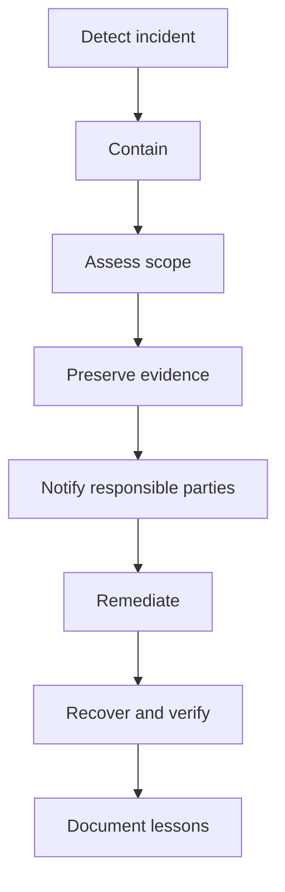

# Plumber Growth System — Security, Privacy and Compliance

## Document Control

| Field | Value |
|---|---|
| Project | Plumber Growth System |
| Document | Security, Privacy and Compliance |
| Document ID | 14-security-privacy-and-compliance |
| Version | 1.0 |
| Status | Draft for Legal and Security Review |
| Parent Documents | 00-project-overview.md through 13-analytics-and-conversion-tracking.md |
| Primary Market | United States |
| Public Website | Next.js on Cloudflare Pages |
| CRM and Communications | GoHighLevel |

---

## 1. Purpose

This document defines the security, privacy and compliance controls for the Plumber Growth System.

It addresses:

- Security governance
- Access control
- Secret management
- Data minimization
- Native forms
- GoHighLevel integrations
- Website onboarding
- SMS
- Calls
- Email
- Reviews
- Emergency messaging
- Analytics
- File uploads
- Vendor management
- Incident response
- Data retention
- Data deletion
- Cancellation
- Client responsibilities
- Agency responsibilities

---

## 2. Important Limitation

This document is a product, engineering and operational control framework. It is not legal advice.

Applicable requirements may depend on:

- Federal law
- State law
- Local law
- Customer location
- Business location
- Communication technology
- Communication purpose
- Consent method
- Call-recording practices
- Industry-specific activity
- Vendor terms
- Platform policies

Final consent language, privacy notices, contracts, retention periods, call-recording practices and marketing workflows require review by qualified legal counsel.

---

## 3. Security Objectives

The system must protect:

### Confidentiality

Prevent unauthorized access to:

- Customer information
- Client onboarding data
- GHL data
- Integration credentials
- Agency operational data
- Billing information
- Private feedback

### Integrity

Prevent unauthorized or accidental changes to:

- Business information
- Service requests
- Opportunities
- Workflows
- Consent records
- Reviews
- Client configuration
- Website deployments

### Availability

Maintain reliable access to:

- Public websites
- Service-request forms
- Emergency Request forms
- GHL conversations
- Calls
- Operational workflows

### Accountability

Maintain records of:

- Access
- Configuration
- Deployments
- Consent
- Workflow changes
- Security events
- Incidents
- Deletion and export actions

---

## 4. Shared Responsibility Model

### Agency responsibilities

The agency is generally responsible for:

- Website code
- Cloudflare configuration
- GHL snapshot architecture
- Workflow configuration
- Integration credentials
- Access control under agency administration
- Secure deployment practices
- Technical incident response
- Client-specific configuration
- Vendor configuration
- Scope and usage disclosures

### Plumbing client responsibilities

The plumbing client is generally responsible for:

- Accurate business information
- Legitimate customer data
- Communication purpose
- Customer consent
- User behavior
- Staff access
- Responding to privacy requests
- Review-request eligibility
- Call-recording decisions
- Lawful use of the platform
- Promptly reporting staffing and business changes

### Vendor responsibilities

Third-party providers are responsible for their respective hosted services under their agreements and policies.

The actual legal roles of controller, business, processor, service provider or contractor must be established through appropriate agreements and jurisdictional review.

---

## 5. Data Inventory

### 5.1 Public business data

Examples:

- Business name
- Phone
- Email
- Address
- Hours
- Services
- Service areas
- Licenses
- Reviews
- Social profiles

Classification:

```text
Public
```

### 5.2 Plumbing customer data

Examples:

* Name
* Phone
* Email
* Service address
* Plumbing problem
* Appointment request
* Conversation history
* Estimate status
* Job outcome

Classification:

```text
Confidential
```

### 5.3 Emergency-request data

Examples:

* Property address
* Emergency type
* Flooding
* Water shutoff
* Gas odor
* Electrical danger

Classification:

```text
Confidential — Operationally Sensitive
```

### 5.4 Private feedback

Examples:

* Rating
* Written feedback
* Technician reference
* Permission to contact
* Testimonial consent

Classification:

```text
Confidential
```

### 5.5 Client onboarding data

Examples:

* Business operations
* Domain information
* Licenses
* Platform information
* Notification recipients
* Internal processes

Classification:

```text
Confidential — Restricted
```

### 5.6 Credentials and secrets

Examples:

* GHL token
* Turnstile secret
* Signing key
* Payment secret
* API credentials

Classification:

```text
Restricted Secret
```

### 5.7 Billing data

Examples:

* Subscription identifier
* Payment status
* Invoice
* Usage charges

Classification:

```text
Confidential — Financial
```

The system must not collect complete payment-card information through Next.js forms.

---

## 6. Data-Minimization Rules

Collect only what is necessary to:

* Respond to plumbing requests
* Understand service needs
* Route inquiries
* Schedule
* Manage opportunities
* Collect feedback
* Implement the client website
* Administer the subscription
* Maintain consent records

### Do not collect through public forms

* Social Security numbers
* Government identification
* Bank information
* Full payment-card details
* Medical information
* Account passwords
* Recovery codes
* Private API keys
* Unnecessary identity documents
* Unrelated sensitive personal information

### Free-text warning

Free-text fields may contain information the system did not request.

Therefore:

* Apply length limits
* Avoid copying them into analytics
* Avoid full-payload logs
* Restrict employee access
* Provide guidance about what not to submit

---

## 7. Privacy-by-Design Requirements

Every new feature must answer:

1. What data is collected?
2. Why is it collected?
3. Is every field necessary?
4. Where is the data stored?
5. Who can access it?
6. Which vendors receive it?
7. How long is it retained?
8. How can it be corrected?
9. How can it be exported or deleted?
10. What happens after cancellation?
11. What consent or notice is required?
12. What is the failure or breach impact?

A feature should not launch without answers to these questions.

---

## 8. Access Control

### Least privilege

Users receive only the access required for their role.

### Agency administrator

May access:

* Workflows
* Integrations
* Custom fields
* Phone configuration
* Email configuration
* SaaS settings
* Cloudflare
* Repository
* Deployment
* Snapshot management

### Plumbing owner

May access:

* Conversations
* Contacts
* Opportunities
* Calendars
* Reputation
* Invoices
* Relevant reports

### Office manager

May access operational customer functions but should not automatically receive technical or billing administration.

### Technician

Should receive only assigned operational access when needed.

### Access review

Review access:

* During onboarding
* Quarterly
* After role changes
* After employee departure
* After client cancellation
* After a security incident

### Shared accounts

Shared user accounts should be avoided.

Each authorized user should have an individual account where supported.

---

## 9. Authentication

Require:

* Unique user identities
* Strong passwords
* Multifactor authentication where supported
* Secure invitation flows
* Prompt access revocation
* Recovery-channel protection

### Prohibited

* Passwords in onboarding forms
* Passwords in email
* Passwords in SMS
* Shared password documents
* Credentials committed to Git
* Credentials placed in screenshots
* Reusing agency credentials across clients unnecessarily

---

## 10. Secret Management

Secrets must be:

* Stored in Cloudflare environment bindings
* Scoped per client where practical
* Excluded from Git
* Excluded from public configuration
* Excluded from analytics
* Excluded from logs
* Rotatable
* Documented by purpose, not value
* Limited to required permissions

### Secret examples

```text
TURNSTILE_SECRET_KEY
GHL_PRIVATE_INTEGRATION_TOKEN
FORM_SIGNING_SECRET
AGENCY_GHL_PRIVATE_INTEGRATION_TOKEN
```

### Rotation triggers

Rotate when:

* Exposure is suspected
* Access changes
* An employee leaves
* A client cancels
* A vendor recommends rotation
* A repository is compromised
* An environment is misconfigured

---

## 11. Repository Security

Repositories should be private unless a specific public-release decision is approved.

### Required protections

* Branch protection
* Pull-request review
* Secret scanning
* Dependency monitoring
* Limited administrative access
* No production secrets in files
* No client customer data
* No password documents
* No raw onboarding exports
* Versioned changes
* Reviewable deployment history

### Commit hygiene

Do not include sensitive information in:

* Source files
* Commit messages
* Pull-request descriptions
* Issues
* Test fixtures
* Screenshots
* Build artifacts

---

## 12. Cloudflare Security

Configure:

* HTTPS
* Valid SSL
* Environment separation
* Turnstile
* Request-size limits
* Rate limiting
* Origin checks
* Secure environment variables
* Restricted deployment access
* Log minimization
* Preview `noindex`

### Security headers

Evaluate and configure:

* Content Security Policy
* Strict Transport Security
* Referrer Policy
* Permissions Policy
* X-Content-Type-Options
* Frame restrictions
* Cross-origin policies where appropriate

Headers must be tested because an overly restrictive policy can break GHL chat, Turnstile, analytics or required embeds.

---

## 13. Native Form Security

Every public form must use:

* Server-side validation
* Turnstile
* Honeypot
* Rate limiting
* Request-size limits
* Controlled field allowlist
* Output encoding
* Idempotency controls
* Safe errors
* Restricted logging

### Browser validation

Browser validation improves usability but is not a security boundary.

### Server validation

The Cloudflare Function must remain authoritative.

### Form success

Do not display success unless the required downstream records are accepted or a reliable recovery process has safely taken ownership of the submission.

---

## 14. Input Handling

Normalize:

* Names
* Emails
* Phone numbers
* States
* ZIP codes
* Whitespace
* Dates
* Controlled enum values

Reject:

* Unsupported field names
* Excessive payloads
* Invalid service values
* Invalid location values
* Executable markup
* Control characters
* Unknown form types
* Invalid access tokens
* Unverified Turnstile tokens

Customer messages must be rendered as text, not trusted HTML.

---

## 15. File Upload Policy

Public file uploads are disabled in version one.

### Reason

Secure uploads require decisions about:

* Storage
* File types
* File size
* Malware scanning
* Metadata
* Access
* Sharing
* Retention
* Deletion
* Audit logs

### Client assets

Logo, photography, licenses and related documents must use an approved secure delivery method.

### Future upload requirements

If uploads are later enabled:

* Allowlist file types
* Enforce actual content type
* Rename stored files
* Enforce size limits
* Scan files
* Strip metadata where appropriate
* Store outside the public web root
* Use expiring access links
* Restrict authorized users
* Define deletion and retention

---

## 16. Website Onboarding Security

The onboarding form must:

* Require signed or authenticated access
* Use an expiring token
* Be client-specific
* Prevent token reuse when appropriate
* Use `noindex, nofollow`
* Avoid exposing values in URLs
* Avoid public analytics
* Avoid passwords
* Avoid payment-card information
* Use restricted operational storage

### Robots limitation

`noindex` is not security.

The onboarding page requires actual access control.

---

## 17. GoHighLevel Integration Security

Each client should use:

* Client-specific Location ID
* Client-specific integration credentials
* Least-privilege scopes
* Server-side credential storage
* Controlled custom-field mapping
* Controlled tags
* Controlled pipeline IDs

### Cross-client protection

The server must not select a client location based on an untrusted browser parameter.

Each deployed client site must have a fixed trusted GHL location configuration.

### Mapping failures

If field or stage IDs are invalid:

* Stop processing
* Return a controlled error
* Alert the agency
* Do not guess a destination

---

## 18. Logging Security

### Permitted log fields

* Submission ID
* Form type
* Environment
* Timestamp
* Processing stage
* Result category
* Error code
* Duration
* Retry count

### Restricted from ordinary logs

* Full name
* Full email
* Full phone
* Full address
* Customer message
* Emergency details
* Private feedback
* Onboarding content
* Access tokens
* Webhook URLs
* Consent text
* Payment details

Use masked identifiers only when necessary for diagnosis.

---

## 19. Analytics Privacy

Do not send personal information to general analytics systems.

### Prohibited analytics data

* Names
* Emails
* Phones
* Addresses
* Customer messages
* Emergency answers
* Private ratings
* Feedback
* Onboarding information
* GHL identifiers
* Billing information

### Advertising features

Advertising cookies, remarketing and enhanced conversion features require separate review, disclosures and consent configuration.

### Session replay

Session replay is disabled by default.

It requires separate approval because it can capture sensitive form behavior and page content.

---

## 20. Privacy Notice Requirements

The client website’s Privacy Policy should address, as applicable:

* Information collected
* Forms
* Calls
* Text messaging
* Email
* Chat
* Appointments
* Reviews
* Analytics
* Turnstile
* Cloudflare
* GoHighLevel
* Payment providers
* Advertising tools
* Data sharing
* Retention
* Security
* User choices
* Contact information
* State-specific rights
* Policy updates

The privacy notice must describe actual practices. Template language must be customized and legally reviewed.

---

## 21. Cookie and Tracking Notice

Determine whether the website requires:

* Cookie banner
* Consent-management platform
* Analytics consent
* Advertising consent
* Preference controls
* Consent logs
* Geographic behavior

Do not display a decorative cookie banner that fails to control tracking behavior.

When consent is required:

* Nonessential tracking should wait for the relevant permission
* Withdrawal should be available
* Consent should be recorded
* The policy should explain the categories

---

## 22. Privacy Request Process

Establish a documented process for requests involving:

* Access
* Correction
* Deletion
* Portability
* Opt-out
* Consent withdrawal
* Complaint
* Appeal where required

### Request workflow

1. Receive the request.
2. Verify identity appropriately.
3. Identify the responsible client and systems.
4. Record the request.
5. Preserve required records.
6. Search relevant systems.
7. Complete approved action.
8. Respond within the applicable timeline.
9. Record completion.

Do not disclose personal information before appropriate identity verification.

---

## 23. Children’s Privacy

The Plumber Growth System is not directed to children.

Public plumbing forms should not knowingly request information from children.

If the business learns that a child submitted personal information:

* Escalate for review
* Avoid unnecessary use
* Follow the applicable deletion and response process

Do not add child-directed features without separate privacy analysis.

---

## 24. SMS Communication Categories

Separate SMS into:

### Service-related SMS

Examples:

* Form acknowledgment
* Missed-call response
* Appointment communication
* Estimate follow-up
* Customer support
* Review request connected to completed service

### Marketing SMS

Examples:

* Promotions
* Seasonal campaigns
* Discounts
* General reactivation
* Cross-selling unrelated services
* Recurring promotional messages

Consent for one category must not be assumed to authorize every other category.

---

## 25. SMS Consent Requirements

Before implementing automated SMS, confirm:

* Who is sending
* What technology is used
* The message purpose
* The consent required
* How consent is recorded
* How consent may be revoked
* How DND is enforced
* Message frequency
* Quiet hours
* State-specific requirements
* Carrier and platform requirements

### Consent records

Store:

* Consent type
* Consent text version
* Phone number
* Timestamp
* Source form
* Page URL
* Submission ID
* Withdrawal status

### Marketing consent

Marketing SMS consent should be:

* Separate
* Optional
* Unchecked by default
* Specific to the identified business
* Unnecessary for purchasing unrelated services

### Revocation

The FCC states that a consumer may revoke consent for robocalls or robotexts through a reasonable method. The system must treat opt-out messages and other valid revocation signals seriously and stop affected automated communications.

---

## 26. SMS Opt-Out Handling

Support common opt-out language, including platform-recognized keywords such as:

```text
STOP
UNSUBSCRIBE
CANCEL
END
QUIT
```

Also establish a manual process for reasonable natural-language revocation requests.

### After opt-out

* Mark DND appropriately
* Stop affected automated communication
* Record the withdrawal
* Do not restart marketing automatically
* Permit only legally and operationally appropriate confirmation or exempt communication
* Escalate ambiguous cases

### Help

Support an appropriate HELP response containing:

* Business identity
* Support contact
* Opt-out information

Final language requires legal and carrier review.

---

## 27. SMS Frequency and Quiet Hours

The system must:

* Limit message volume
* Avoid redundant workflow enrollment
* Use suppression windows
* Stop after reply when appropriate
* Respect client and recipient time zones
* Separate emergency acknowledgment from promotion
* Avoid indefinite sequences

Final quiet hours and frequency limits require legal and operational review.

---

## 28. Missed-Call Text-Back Compliance

Before activation:

* Confirm the client wants the feature
* Confirm the business identity
* Confirm eligible call events
* Configure a suppression window
* Honor DND
* Test opt-outs
* Avoid promotional language
* Avoid repeated messages after multiple calls
* Confirm local and federal requirements

Working message:

> Hi, this is {{location.name}}. Sorry we missed your call. How can we help with your plumbing issue? Reply STOP to opt out.

Final approval is required before production.

---

## 29. Email Compliance

Separate:

* Transactional or relationship email
* Commercial or promotional email

For commercial email, FTC guidance includes requirements such as:

* Accurate header information
* Nondeceptive subject lines
* Clear identification where required
* A valid physical postal address
* A clear opt-out method
* Honoring opt-out requests

### Email controls

The system must:

* Use an accurate sender identity
* Use a monitored reply address
* Avoid deceptive subjects
* Include required business information
* Include unsubscribe mechanisms when applicable
* Maintain suppression lists
* Avoid emailing invalid or purchased lists without review

---

## 30. Call Compliance

Before enabling calling features, review:

* Caller identification
* Automated dialing
* Artificial or prerecorded voice
* Consent
* Do-not-call requirements
* Call recording
* Time-of-day restrictions
* State-specific laws
* Internal access
* Retention

### Call recording

Call recording is disabled unless:

* The client approves it
* Required notice is implemented
* Applicable consent requirements are reviewed
* Retention is defined
* Access is restricted
* Deletion is supported

A general website statement may not be sufficient for every situation.

---

## 31. Emergency Messaging Compliance

The Emergency Plumbing Request system must state:

* Submission does not guarantee immediate service
* Submission does not confirm dispatch
* Technician availability is not guaranteed
* Requested timing is not confirmed
* Immediate safety threats require appropriate emergency or utility contact

### Gas odor

Display:

> Leave the affected area and contact the appropriate gas utility or emergency service from a safe location. Do not rely on this website form for an immediate gas-related emergency response.

### Prohibited emergency claims

Do not automatically state:

* Technician dispatched
* Technician on the way
* Immediate response guaranteed
* Arrival within a fixed time
* Problem is safe
* Customer should perform a repair

---

## 32. Review Compliance

The review system must request genuine, unbiased feedback.

Google’s policies prohibit fake engagement, incentivized reviews and rating manipulation.

### Required controls

* Request honest reviews
* Use verified customers
* Use the same public-review opportunity regardless of private rating
* Do not offer payment or discounts for positive reviews
* Do not request removal of a negative review in exchange for value
* Do not fabricate reviewers
* Do not post reviews on behalf of customers
* Do not use employees or contractors deceptively
* Do not publish private feedback without permission

### Private feedback

Private feedback may:

* Trigger service recovery
* Create an internal task
* Record testimonial permission

It must not be used to hide the public-review option from dissatisfied customers.

---

## 33. Testimonial Compliance

Before publishing a testimonial:

* Confirm it is genuine
* Preserve its meaning
* Obtain appropriate permission
* Record attribution choice
* Disclose material relationships or incentives
* Avoid unsupported results claims
* Remove it when permission is withdrawn where required

Do not:

* Combine multiple testimonials
* Rewrite the statement materially
* Add an invented rating
* Invent a customer identity
* Attribute private feedback publicly without consent

---

## 34. Structured Data Compliance

Structured data must:

* Match visible content
* Use verified information
* Use canonical URLs
* Represent actual services
* Represent legitimate locations
* Avoid fabricated reviews
* Avoid unsupported aggregate ratings
* Avoid misleading availability
* Validate before launch

Rich-result eligibility is not guaranteed.

---

## 35. Business-Claim Compliance

Verify before publication:

* Business name
* Address
* Phone
* Hours
* Service area
* Licenses
* Insurance
* Bonding
* Certifications
* Years in business
* Emergency availability
* 24/7 availability
* Financing
* Warranties
* Guarantees
* Review counts
* Customer ratings
* Response-time claims

Do not publish placeholders as facts.

---

## 36. Local SEO and Business Profile Compliance

Do not:

* Create fake offices
* Publish locations the client does not serve
* Keyword-stuff the business name
* Create duplicate profiles
* Fabricate local proof
* Generate mass doorway pages
* Use fake reviews
* Misrepresent hours
* Misrepresent service availability

Address-display behavior must match the business’s legitimate operating model.

---

## 37. Accessibility Compliance

The product targets WCAG 2.2 AA practices.

Security and consent interfaces must also be accessible, including:

* Cookie controls
* Privacy request forms
* Consent checkboxes
* Error messages
* Authentication
* Onboarding
* Emergency notices

Accessibility claims should reflect actual testing rather than unsupported certification.

---

## 38. Vendor Management

Evaluate vendors that process client or customer data.

Initial vendors may include:

* Cloudflare
* GoHighLevel
* Stripe
* GitHub
* Google
* Microsoft
* Apple
* Email service providers
* Phone and messaging providers
* Analytics providers

### Vendor review

Document:

* Service purpose
* Data categories
* Data location where relevant
* Contract terms
* Security documentation
* Subprocessors
* Retention
* Deletion
* Incident notification
* Access controls
* Data-processing terms
* Portability
* Termination behavior

Do not assume that enabling a vendor feature automatically satisfies the client’s compliance obligations.

---

## 39. Data Processing Agreements

Determine whether appropriate agreements are needed between:

* Agency and plumbing client
* Agency and GHL
* Agency and Cloudflare
* Agency and analytics vendors
* Client and agency subprocessors
* Client and communications providers

The final contracting structure must identify responsibilities for:

* Instructions
* Confidentiality
* Security
* Subprocessors
* Incidents
* Privacy requests
* Retention
* Deletion
* Audit
* Termination

---

## 40. Data Retention

Retention must be defined by data category.

### Categories requiring a schedule

* Form-processing logs
* GHL contacts
* Conversations
* Opportunities
* Appointments
* Call recordings
* Call transcripts
* Private feedback
* Testimonial permissions
* Consent records
* Onboarding submissions
* Security logs
* Billing records
* Support records
* Repository history
* Backups

### Retention principles

* Keep data only as long as necessary
* Preserve legally required records
* Use shorter periods for diagnostic logs
* Restrict long-term sensitive data
* Document exceptions
* Support deletion where applicable

Final retention periods require legal and operational approval.

---

## 41. Data Deletion

Deletion must be:

* Authorized
* Verified
* Scoped
* Logged
* Coordinated across systems
* Reviewed for legal retention obligations
* Protected from accidental broad deletion

### Systems to evaluate

* GHL
* Cloudflare
* Analytics
* Onboarding storage
* Email systems
* Phone systems
* GitHub
* Backups
* Agency operational records

Deletion from one system does not guarantee deletion from every integrated system.

---

## 42. Data Export

Define export formats for:

* Contacts
* Opportunities
* Appointments
* Conversations where supported
* Consent records
* Website content
* Public client assets
* Analytics access

Exports must:

* Be sent securely
* Be limited to authorized recipients
* Exclude agency secrets
* Exclude unrelated client data
* Avoid transferring reusable agency intellectual property unless contractually required

---

## 43. Cancellation Security

At cancellation:

1. Verify requester authority.
2. Record the effective date.
3. Stop future billing according to policy.
4. Review active workflows.
5. Review communications.
6. Revoke integration credentials.
7. Remove Cloudflare secrets.
8. Review user access.
9. Address phone-number status.
10. Address domain and website status.
11. Export eligible data.
12. Apply retention policy.
13. Archive required records.
14. Confirm completion.

Do not automatically delete data or infrastructure before completing the approved termination checklist.

---

## 44. Security Incident Definition

Potential incidents include:

* Cross-client data routing
* Exposed token
* Unauthorized GHL access
* Compromised repository
* Compromised Cloudflare account
* Form data sent to the wrong client
* Customer data in public analytics
* Unauthorized workflow messages
* Public onboarding exposure
* Malicious code deployment
* Lost administrative device
* Unauthorized call recordings
* Improper review publication

---

## 45. Incident Response Process



### Phase 1: Detection

* Record the report
* Assign incident owner
* Identify affected systems
* Set preliminary severity

### Phase 2: Containment

Potential actions:

* Disable form endpoint
* Pause workflow
* Revoke token
* Roll back deployment
* Disable compromised account
* Block malicious traffic

### Phase 3: Assessment

Determine:

* Data affected
* People affected
* Clients affected
* Duration
* Unauthorized actions
* Legal or contractual notification obligations

### Phase 4: Recovery

* Correct configuration
* Rotate credentials
* Restore known-good deployment
* Validate forms and routing
* Monitor recurrence

### Phase 5: Review

* Document root cause
* Document timeline
* Update controls
* Update training
* Update client records
* Complete required notifications

---

## 46. Incident Severity

### Critical

* Cross-client disclosure
* Public secret exposure
* Unauthorized production access
* Widespread form misrouting
* Active compromise

### High

* One-client data exposure
* Emergency-request failure
* Unauthorized messaging
* Compromised user account
* Public onboarding access

### Moderate

* Limited logging exposure
* Individual workflow error
* Incorrect permission without known access
* Noncritical analytics issue

### Low

* Attempted abuse blocked
* Invalid form submissions
* Minor configuration warning

Severity must be reassessed as evidence develops.

---

## 47. Backup and Recovery

Document recovery for:

* GitHub repository
* Cloudflare deployment
* Client configuration
* GHL snapshot
* Workflow versions
* Integration map
* Agency operational records
* Consent records where supported

Backups must not become ungoverned permanent copies of sensitive data.

Test restoration procedures periodically.

---

## 48. Change Management

Security-sensitive changes require review.

Examples:

* Form fields
* Consent language
* GHL tokens
* Pipeline IDs
* Workflow triggers
* SMS templates
* Review workflows
* Analytics
* Call recording
* File uploads
* Access permissions
* Cancellation automation

### Change record

Document:

* Purpose
* Requester
* Approver
* Systems affected
* Security impact
* Privacy impact
* Test results
* Deployment date
* Rollback method

---

## 49. Security Testing

Required testing includes:

* Secret scanning
* Dependency audit
* Form validation tests
* Turnstile tests
* Rate-limit tests
* Authorization tests
* Onboarding-token tests
* Cross-client isolation tests
* Error-message review
* Analytics payload inspection
* Security-header validation
* Workflow permission review
* Cancellation credential revocation

### Cross-client isolation test

Verify that:

* Client A cannot submit into Client B’s location
* Client A’s token cannot access Client B
* Client configuration cannot be selected by browser input
* Onboarding tokens cannot cross accounts
* Logs and reports remain isolated

---

## 50. Compliance Review Triggers

Require renewed review when:

* Adding AI voice
* Adding recorded calls
* Adding session replay
* Adding advertising tracking
* Adding marketing SMS
* Adding large reactivation campaigns
* Adding file uploads
* Expanding outside the United States
* Adding new vendors
* Adding multilingual markets
* Changing consent language
* Changing data retention
* Changing cancellation behavior
* Integrating dispatch software
* Processing sensitive personal data

---

## 51. Training Requirements

Agency users require training on:

* Access control
* Secrets
* Phishing
* Client isolation
* Consent
* DND
* Review policies
* Emergency limitations
* Privacy requests
* Incident reporting
* Secure asset handling
* Cancellation

Plumbing client users require training on:

* User access
* Conversations
* Consent and opt-outs
* DND
* Reviews
* Call recording
* Customer-data handling
* Reporting suspicious activity
* Removing former employees

---

## 52. Security and Compliance Acceptance Criteria

The product is ready for pilot use when:

1. Data categories are inventoried.
2. Roles and responsibilities are documented.
3. Client credentials are isolated.
4. Multifactor authentication is enabled where supported.
5. Repositories contain no secrets or customer data.
6. Public forms use server-side validation.
7. Turnstile is verified server-side.
8. Rate limiting and idempotency are implemented.
9. Client Onboarding has real access control.
10. Public file uploads remain disabled.
11. Analytics excludes personal information.
12. Service and marketing consent are separate.
13. Opt-outs stop affected automated communication.
14. Commercial email controls are implemented where applicable.
15. Call recording is disabled pending approval.
16. Emergency messages do not promise dispatch.
17. Public reviews are not gated.
18. Business claims are verified.
19. Vendor responsibilities are documented.
20. Retention and deletion policies are approved.
21. Incident response is documented.
22. Cancellation revokes credentials safely.
23. Cross-client isolation tests pass.
24. Legal review items are identified.
25. Staff training is complete.

---

## 53. Open Legal and Security Decisions

The following require final resolution:

* Controller and processor roles
* Data-processing agreements
* State-specific privacy requirements
* Final privacy policy
* Final cookie and consent platform
* Final SMS consent text
* Final marketing SMS policy
* Final quiet hours
* Final reactivation rules
* Final commercial email templates
* Call-recording policy
* Call-transcription policy
* Final data-retention periods
* Final deletion process
* Final data-export process
* Onboarding storage
* Save-and-return security
* Incident-notification timelines
* Website and GHL data treatment after cancellation
* Phone-number portability
* Vendor security-review cadence
* Whether file uploads will be added
* Whether session replay will ever be permitted

---

## 54. Primary Compliance References

Review current official guidance periodically, including:

* FCC Telephone Consumer Protection Act materials
* FCC consent-revocation guidance
* FTC CAN-SPAM guidance
* FTC reviews and endorsements guidance
* Google Maps user-contribution policies
* Google Business Profile policies
* Applicable state privacy and call-recording laws
* Vendor security and privacy documentation
* Applicable platform messaging policies

---

## 55. Next Document

The next project document is:

`15-testing-and-quality-assurance.md`

It will define:

* Testing strategy
* Unit tests
* Integration tests
* End-to-end tests
* Accessibility QA
* SEO QA
* Security QA
* GHL workflow testing
* Form testing
* Browser and device coverage
* Release gates
* Defect severity
* Regression testing
* Pilot validation
