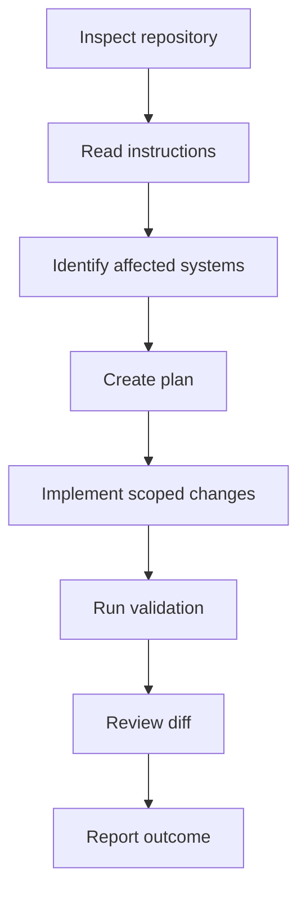

# Plumber Growth System — Claude Code Workflow

## Document Control

| Field | Value |
|---|---|
| Project | Plumber Growth System |
| Document | Claude Code Workflow |
| Document ID | 17-claude-code-workflow |
| Version | 1.0 |
| Status | Draft for Approval |
| Parent Documents | 00-project-overview.md through 16-deployment-and-maintenance.md |
| Strategy Environment | Claude Project |
| Implementation Environment | Claude Code and Visual Studio Code |
| Source Control | GitHub |

---

## 1. Purpose

This document defines how Claude Project, Claude Code, Visual Studio Code, GitHub and Cloudflare Pages will work together.

It establishes:

- Responsibility boundaries
- Authoritative documentation
- Repository instructions
- Task planning
- Prompt structure
- Implementation phases
- File changes
- Validation
- Git practices
- Documentation updates
- Security restrictions
- Failure handling
- Completion reporting
- Human approval points

---

## 2. Tool Responsibilities

## 2.1 Claude Project

Claude Project is responsible for:

- Product strategy
- Requirements
- Information architecture
- Design direction
- Content strategy
- SEO strategy
- Form specifications
- GHL architecture
- Workflow specifications
- Security requirements
- Testing requirements
- Implementation planning
- Creating prompts for Claude Code
- Reviewing Claude Code reports
- Identifying unresolved decisions

Claude Project does not have authority to claim that repository work was completed unless Claude Code performed and validated it.

## 2.2 Claude Code

Claude Code is responsible for:

- Inspecting the repository
- Reading repository instructions
- Understanding existing code
- Creating an implementation plan
- Modifying files
- Adding tests
- Running validation
- Reporting changed files
- Reporting command results
- Identifying assumptions
- Identifying blockers
- Preserving unrelated work

Claude Code should not independently redefine the product strategy.

## 2.3 Visual Studio Code

Visual Studio Code is used for:

- Reviewing changes
- Comparing diffs
- Editing files manually
- Running Claude Code
- Running terminal commands
- Reviewing tests
- Resolving merge conflicts
- Inspecting previews
- Managing Git

## 2.4 GitHub

GitHub is used for:

- Source control
- Branches
- Pull requests
- Change review
- Continuous integration
- Release history
- Issue tracking
- Repository access

## 2.5 Cloudflare Pages

Cloudflare Pages is used for:

- Preview deployments
- Production deployments
- Static website hosting
- Pages Functions
- Environment variables
- Custom domains
- Rollbacks

## 2.6 GoHighLevel

GHL remains responsible for:

- Contacts
- Opportunities
- Conversations
- Calendars
- Calls
- Reputation
- Workflows
- SaaS account provisioning

Claude Code may implement the website integration but must not assume that manual GHL configuration has been completed.

---

## 3. Source-of-Truth Hierarchy

When instructions conflict, use this order:

1. Current explicit user instruction
2. Repository `CLAUDE.md`
3. Approved project decision log
4. Approved product requirements
5. Approved technical and security documents
6. Approved page or feature specification
7. Existing tested repository behavior
8. General conventions

Claude Code must report material conflicts instead of silently choosing one source.

---

## 4. Repository Instruction File

Create a root-level:

```text
CLAUDE.md
```

It should summarize:

* Product purpose
* Technology stack
* Build commands
* Architecture boundaries
* File organization
* Forms architecture
* GHL integration boundary
* Security requirements
* Accessibility requirements
* Validation requirements
* Prohibited changes
* Documentation expectations

### Keep `CLAUDE.md` concise

It should direct Claude Code to detailed documents rather than duplicate every project specification.

### Recommended documentation references

```text
docs/00-project-overview.md
docs/01-product-requirements-document.md
docs/04-website-information-architecture.md
docs/05-technical-architecture.md
docs/06-design-system.md
docs/08-nextjs-form-specifications.md
docs/11-data-mapping-and-integrations.md
docs/14-security-privacy-and-compliance.md
docs/15-testing-and-quality-assurance.md
docs/16-deployment-and-maintenance.md
docs/18-decision-log.md
```

---

## 5. Recommended `CLAUDE.md` Content

```markdown
# Plumber Growth System Repository Instructions

## Product

This repository contains the reusable Next.js plumbing website system for the $297-per-month Plumber Growth System SaaS product.

The public website is built in Next.js and deployed to Cloudflare Pages. GoHighLevel provides CRM, conversations, opportunities, calendars, reputation and workflows.

## Architecture Boundaries

- Do not use GHL Websites.
- Do not use GHL Funnels.
- Do not use GHL Form Builder.
- Do not use GHL Survey Builder.
- All five website forms are native Next.js forms.
- Cloudflare Pages Functions process form submissions.
- GHL credentials must remain server-side.
- Client-specific public data belongs in typed configuration.
- Secrets must not be committed to Git.
- Public forms must use server-side validation, Turnstile, rate limiting and idempotency.
- Public file uploads are disabled in version one.

## Required Forms

1. General Plumbing Quote Request
2. Emergency Plumbing Request
3. Contact Form
4. Review Feedback Form
5. Website Onboarding Form

## Quality

Before reporting completion, run the applicable:

- Format check
- Lint
- Type check
- Unit tests
- Integration tests
- Production build
- End-to-end tests when required
- Accessibility checks when required

## Working Rules

- Inspect the repository before editing.
- Preserve unrelated changes.
- Follow approved documentation.
- Do not invent client facts.
- Do not weaken security or accessibility to pass tests.
- Do not expose personal data in analytics or logs.
- Do not claim success without validation results.
- Report changed files, validation, assumptions and unresolved issues.
```

---

## 6. Documentation Structure

Recommended repository structure:

```text
docs/
├── 00-project-overview.md
├── 01-product-requirements-document.md
├── 02-offer-and-pricing-strategy.md
├── 03-ideal-customer-profile.md
├── 04-website-information-architecture.md
├── 05-technical-architecture.md
├── 06-design-system.md
├── 07-content-and-seo-strategy.md
├── 08-nextjs-form-specifications.md
├── 09-ghl-snapshot-architecture.md
├── 10-ghl-workflow-specifications.md
├── 11-data-mapping-and-integrations.md
├── 12-client-onboarding-and-fulfillment.md
├── 13-analytics-and-conversion-tracking.md
├── 14-security-privacy-and-compliance.md
├── 15-testing-and-quality-assurance.md
├── 16-deployment-and-maintenance.md
├── 17-claude-code-workflow.md
├── 18-decision-log.md
└── 19-launch-checklist.md
```

---

## 7. Task Lifecycle

Every Claude Code task should follow:



---

## 8. Phase 1: Repository Inspection

Before editing, Claude Code must inspect:

* Repository status
* Current branch
* Existing files
* `CLAUDE.md`
* Relevant documentation
* Package configuration
* Framework configuration
* TypeScript configuration
* Existing tests
* Existing form architecture
* Existing Cloudflare configuration
* Existing uncommitted changes

### Recommended commands

```bash
git status --short
git branch --show-current
rg --files
```

Then inspect only the files relevant to the task.

### Dirty worktree

Existing changes belong to the user unless clearly identified otherwise.

Claude Code must:

* Preserve unrelated changes
* Avoid overwriting uncommitted work
* Report overlapping changes
* Request direction when safe isolation is impossible

---

## 9. Phase 2: Requirement Review

Claude Code must identify:

* Task objective
* Relevant approved documents
* Acceptance criteria
* Files likely affected
* Security implications
* Accessibility implications
* SEO implications
* Data implications
* Required validation
* Open decisions

If a missing decision would materially change the implementation, stop and request direction.

Do not ask unnecessary questions when existing documentation provides the answer.

---

## 10. Phase 3: Implementation Plan

Before major changes, produce a concise plan.

Example:

```text
1. Inspect the current client configuration and route generation.
2. Add typed service and service-area schemas.
3. Generate enabled static routes.
4. Update navigation and sitemap to use the same configuration.
5. Add configuration validation tests.
6. Run lint, typecheck, tests and production build.
```

A plan should describe meaningful outcomes rather than listing every file operation.

---

## 11. Phase 4: Implementation

Claude Code should:

* Make the smallest complete change
* Reuse existing abstractions
* Avoid unrelated redesigns
* Keep client data centralized
* Add or update tests
* Preserve public interfaces when possible
* Keep server-only code outside client bundles
* Use accessible semantic markup
* Maintain product scope
* Update documentation when behavior changes

### Avoid

* Large unrequested refactors
* Replacing working dependencies without need
* Adding a library for trivial functionality
* Hard-coding client-specific GHL identifiers
* Scattering business data through components
* Disabling tests to obtain a passing build
* Creating GHL forms, funnels or websites
* Adding public file uploads
* Publishing unsupported claims

---

## 12. Phase 5: Validation

Run validation proportional to the change.

### Minimum for content-only changes

* Formatting
* Type check when content is typed
* Production build
* Broken-link or route validation where applicable

### Minimum for component changes

* Formatting
* Lint
* Type check
* Relevant unit/component tests
* Production build
* Responsive review
* Accessibility review

### Minimum for form changes

* Formatting
* Lint
* Type check
* Schema tests
* Integration tests
* Failure tests
* Production build
* Accessibility tests
* End-to-end form test

### Minimum for integration changes

* Unit tests
* Mocked GHL integration tests
* Partial-failure tests
* Idempotency tests
* Cross-client isolation review
* Preview environment test
* Controlled end-to-end GHL test

### Minimum for deployment changes

* Production build
* Cloudflare preview
* Environment validation
* Functions routing
* Form smoke tests
* Rollback review

---

## 13. Phase 6: Diff Review

Before reporting completion, Claude Code must review:

```bash
git status --short
git diff --stat
git diff
```

Review for:

* Unrelated changes
* Secrets
* Placeholder values
* Debug statements
* Disabled tests
* Personal information
* Accidental dependency changes
* Incorrect routes
* Incorrect canonical URLs
* Broad formatting churn

---

## 14. Completion Report

Every implementation report should include:

### Outcome

What now works.

### Changed files

List meaningful changed files or groups.

### Validation

List commands and results.

### Assumptions

State implementation assumptions.

### Remaining issues

State anything unresolved, untested or blocked.

### Manual steps

Identify required actions such as:

* Cloudflare environment variables
* GHL field IDs
* DNS changes
* GHL workflow publication
* Client approval

### Example

```markdown
Implemented the General Plumbing Quote Request form and its Cloudflare endpoint.

Changed:
- Added the native form component and validation schema.
- Added Turnstile verification.
- Added GHL contact and opportunity mapping.
- Added unit and integration tests.

Validation:
- Formatting: passed
- Lint: passed
- Type check: passed
- Unit tests: passed
- Integration tests: passed
- Production build: passed

Manual configuration still required:
- GHL Location ID
- GHL private integration token
- Pipeline and stage IDs
- Turnstile production keys
```

---

## 15. Prompt Structure for Claude Code

A strong implementation prompt should contain:

1. Context
2. Objective
3. Required reading
4. Existing decisions
5. Scope
6. Explicit exclusions
7. Implementation requirements
8. Acceptance criteria
9. Validation requirements
10. Completion-report format

---

## 16. Standard Claude Code Prompt Template

```markdown
# Task

[Concise task name]

## Context

This repository contains the Plumber Growth System, a reusable Next.js website and lead-response system for plumbing companies.

The public website is deployed to Cloudflare Pages. Native Next.js forms are processed through Cloudflare Pages Functions and routed into GoHighLevel.

## Read Before Editing

Read:

- `CLAUDE.md`
- `[relevant project documents]`
- Relevant existing source files and tests

Inspect the repository and current Git status before making changes.

## Objective

[Describe the exact outcome.]

## Approved Decisions

- [List settled decisions relevant to this task.]

## Scope

Implement:

- [Required item]
- [Required item]
- [Required item]

## Do Not Change

- Unrelated content
- Unrelated routes
- Product pricing
- GHL architecture outside this task
- Existing client data
- [Other boundaries]

## Technical Requirements

- Use TypeScript strict mode.
- Preserve the static-export architecture.
- Keep private credentials server-side.
- Use existing design-system components.
- Maintain WCAG 2.2 AA practices.
- Do not expose personal information in analytics or logs.
- Add or update tests.

## Acceptance Criteria

1. [Measurable condition]
2. [Measurable condition]
3. [Measurable condition]

## Validation

Run the applicable:

- Format check
- Lint
- Type check
- Unit tests
- Integration tests
- Production build
- End-to-end or accessibility tests when relevant

Do not report completion if required checks fail.

## Completion Report

Report:

- Outcome
- Changed files
- Validation commands and results
- Assumptions
- Unresolved issues
- Required manual configuration
```

---

## 17. Prompt Scoping Rules

### One major concern per task

Prefer separate tasks for:

* Repository initialization
* Design system
* Route architecture
* Forms
* GHL integration
* Analytics
* Deployment
* Content implementation

Avoid asking Claude Code to build the entire production system in one prompt.

### Bounded batches

A task may include related work when it shares:

* The same architecture
* The same files
* The same validation
* The same acceptance criteria

### Explicit exclusions

Every major prompt should state what not to change.

---

## 18. Recommended Implementation Phases

### Phase 1: Repository foundation

* Initialize Next.js
* Configure TypeScript
* Configure static export
* Configure formatting and linting
* Configure tests
* Add `CLAUDE.md`
* Add project documentation
* Add CI

### Phase 2: Client configuration

* Typed business configuration
* Services
* Service areas
* Navigation
* SEO configuration
* Production-placeholder validation

### Phase 3: Design system

* Tokens
* Typography
* Layout
* Header
* Footer
* Buttons
* Cards
* Alerts
* Forms
* Mobile action bar

### Phase 4: Page templates

* Homepage
* Services hub
* Service pages
* Residential
* Commercial
* Service areas
* Location pages
* About
* Reviews
* FAQs
* Contact
* Legal pages

### Phase 5: Native forms

* Shared form primitives
* General Quote
* Emergency Request
* Contact
* Review Feedback
* Website Onboarding

### Phase 6: Cloudflare Functions

* Routing
* Schemas
* Turnstile
* Rate limiting
* Idempotency
* Safe responses
* Logging

### Phase 7: GHL integration

* Contact matching
* Contact updates
* Opportunities
* Tags
* Workflow-trigger contract
* Failure handling
* Tests

### Phase 8: Analytics and SEO

* Events
* Attribution
* Metadata
* Sitemap
* Robots
* Structured data
* Search platform preparation

### Phase 9: Deployment

* Cloudflare project
* Preview environment
* Production environment
* Domain
* DNS
* Monitoring
* Rollback

### Phase 10: Pilot validation

* First client configuration
* End-to-end GHL tests
* Client review
* Launch
* 30-day review
* Product refinements

---

## 19. Git Workflow

### Before changes

```bash
git status --short
git branch --show-current
```

### Branch naming

```text
feature/[task]
fix/[task]
content/[task]
maintenance/[task]
```

### Commit principles

Commits should be:

* Intentional
* Scoped
* Descriptive
* Free of secrets
* Free of unrelated changes

### Commit examples

```text
Build typed client configuration system
Add native plumbing quote request form
Implement Cloudflare form validation
Connect general quote submissions to GHL
Add accessible emergency request flow
```

Claude Code should not commit, push or open a pull request unless the user’s workflow authorizes it.

---

## 20. Documentation Updates

Update documentation when implementation changes:

* Architecture
* Environment variables
* Routes
* Forms
* GHL mappings
* Workflow triggers
* Analytics events
* Security controls
* Deployment procedures
* Testing requirements

### Decision log

A material product or architecture decision must be added to:

```text
docs/18-decision-log.md
```

Do not leave implementation and documentation materially inconsistent.

---

## 21. Security Rules for Claude Code

Claude Code must never:

* Print secrets
* Commit secrets
* Add secrets to public configuration
* Copy production data into tests
* Put customer information in logs
* Request passwords through forms
* Disable security controls to simplify development
* Route clients dynamically using an untrusted browser parameter
* Expose GHL tokens in client code
* Add file uploads without an approved architecture
* Add session replay without approval

If a secret appears in output or source:

1. Stop.
2. Remove the exposure.
3. Report it.
4. Rotate the credential.
5. Review repository history.
6. Validate the replacement.

---

## 22. Content Rules for Claude Code

Claude Code must not invent:

* Licenses
* Credentials
* Years in business
* Reviews
* Ratings
* Service areas
* Services
* Emergency availability
* 24/7 availability
* Pricing
* Warranties
* Financing
* Response times
* Team members
* Physical locations

Use:

* Typed placeholders blocked from production
* Verified client configuration
* Approved content documents

---

## 23. Form Rules for Claude Code

Every form implementation must:

* Use native controls
* Use persistent labels
* Use shared schemas
* Validate server-side
* Verify Turnstile server-side
* Apply rate limiting
* Apply idempotency
* Use safe errors
* Preserve valid values
* Protect personal information
* Trigger analytics only after acceptance
* Route through the approved GHL adapter

Do not add GHL Form Builder or Survey Builder.

---

## 24. GHL Integration Rules

Claude Code must:

* Isolate GHL code in the integration layer
* Use client-specific server credentials
* Validate mappings
* Apply trigger tags last
* Control opportunity duplication
* Preserve original attribution
* Record most-recent attribution separately
* Handle partial failures
* Keep agency onboarding separate from plumbing customer workflows

Claude Code must not assume that a workflow exists merely because its name is in documentation. Manual GHL configuration must be verified.

---

## 25. Accessibility Rules

Claude Code must:

* Use semantic HTML
* Preserve keyboard navigation
* Provide visible focus
* Associate form errors
* Manage menu focus
* Support reduced motion
* Maintain contrast
* Avoid color-only states
* Use meaningful alternative text
* Test zoom and reflow

Do not use ARIA to replace correct native semantics without need.

---

## 26. SEO Rules

Claude Code must:

* Generate accurate metadata
* Use one canonical hostname
* Exclude disabled routes
* Keep preview deployments non-indexable
* Generate sitemap from approved routes
* Match structured data to visible content
* Avoid fake reviews
* Avoid false locations
* Avoid mass-generated thin pages
* Preserve mobile content parity

---

## 27. Dependency Rules

Before adding a dependency, Claude Code should determine:

* Whether the project already solves the problem
* Whether browser or framework APIs are sufficient
* Cloudflare compatibility
* Bundle impact
* Maintenance status
* Security risk
* License compatibility
* Testing implications

Every added dependency must have a clear purpose.

---

## 28. Destructive-Action Rules

Claude Code must not:

* Delete broad directories without exact confirmation
* Reset the worktree destructively
* Overwrite unrelated changes
* Delete client data
* Delete GHL assets
* Delete Cloudflare projects
* Delete production domains
* Revoke credentials without an approved task
* Run broad database cleanup

Destructive actions require explicit, exact scope and appropriate authorization.

---

## 29. Handling Failures

### Build failure

* Diagnose the specific cause
* Correct it within scope
* Do not suppress the failure
* Report if blocked

### Test failure

* Determine whether the change caused it
* Fix the defect
* Update outdated tests only when behavior was intentionally changed
* Report remaining failures

### GHL test failure

* Avoid repeated uncontrolled production retries
* Inspect safe response details
* Check configuration
* Use test contacts
* Report manual GHL dependencies

### Cloudflare failure

* Review build and Functions configuration
* Preserve production
* Use preview testing
* Do not change DNS as a first troubleshooting step

---

## 30. Handling Ambiguity

Claude Code may make small implementation assumptions when they:

* Stay within approved architecture
* Are reversible
* Do not change customer-facing scope
* Do not affect legal or security posture materially

Claude Code must stop for direction when ambiguity affects:

* Pricing
* Ownership
* Cancellation
* Consent
* Retention
* Client data
* Major design direction
* New third-party vendors
* Paid features
* GHL SaaS architecture
* Production DNS
* Destructive changes

---

## 31. Manual Configuration Reporting

Claude Code must distinguish code completion from external configuration.

Examples:

### Code complete

* Form component created
* Cloudflare endpoint implemented
* Environment validation added
* Tests passed

### Manual configuration required

* Add GHL token
* Add pipeline IDs
* Add custom field IDs
* Configure phone
* Configure review link
* Publish workflow
* Add Cloudflare environment variables
* Connect custom domain
* Verify DNS

Do not report the whole feature operational until both sides have been tested.

---

## 32. Review Checklist for Claude Project

After receiving a Claude Code report, verify:

* Did it inspect first?
* Did it follow the approved scope?
* Did it preserve existing work?
* Did it follow the architecture?
* Did it add tests?
* Did required commands pass?
* Did it distinguish code from manual configuration?
* Did it expose secrets or personal information?
* Did it alter product decisions?
* Did it update documentation?
* Are unresolved issues clear?
* Is a preview or manual test still required?

---

## 33. Completion Definition

A task is complete only when:

1. The approved outcome is implemented.
2. Relevant tests exist.
3. Required validation passes.
4. The diff is reviewed.
5. No secrets are exposed.
6. No unrelated changes are included.
7. Documentation is updated where required.
8. Manual steps are identified.
9. Limitations are disclosed.
10. The completion report is evidence-based.

---

## 34. Claude Code Workflow Acceptance Criteria

This workflow is approved when:

1. Claude Project and Claude Code responsibilities are separate.
2. `CLAUDE.md` defines repository rules.
3. Approved documentation is stored in the repository.
4. Every task begins with inspection.
5. Major tasks receive a plan.
6. Prompts include scope and exclusions.
7. Implementation uses the smallest complete change.
8. Validation is proportional to risk.
9. Claude Code reviews its diff.
10. Reports include actual command results.
11. Secrets and personal data remain protected.
12. External manual configuration is reported separately.
13. Git changes are intentional.
14. Documentation remains aligned.
15. Material decisions enter the decision log.
16. Failures are reported rather than hidden.
17. Production and destructive actions require appropriate authority.
18. Completion is based on evidence.

---

## 35. Next Document

The next project document is:

`18-decision-log.md`

It will record:

* Approved decisions
* Superseded decisions
* Decision dates
* Rationale
* Alternatives
* Consequences
* Documents affected
* Implementation status
